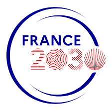

# Atlas

[](https://doi.org/10.5281/zenodo.18310357)

**Atlas** is a TypeScript monorepo developed by **Université Le Havre Normandie** to support research and facilitate collaboration between researchers.

## Packages

### Main Modules

| Package                           | Description                                      |
| --------------------------------- | ------------------------------------------------ |
| [ecrin](packages/ecrin)           | ECRIN module - researcher collaboration platform |
| [amarre](packages/amarre)         | AMARRE module - research network visualization   |
| [@univ-lehavre/crf](packages/crf) | CRF module - REDCap client, server and CLI       |

### Sub-projects

| Package                                                       | Parent Module | Description                                     |
| ------------------------------------------------------------- | ------------- | ----------------------------------------------- |
| [find-an-expert](packages/find-an-expert)                     | ECRIN         | Expertise discovery via publications and GitHub |
| [@univ-lehavre/atlas-redcap-core](packages/redcap-core)       | CRF           | REDCap business logic with Effect               |
| [@univ-lehavre/atlas-redcap-openapi](packages/redcap-openapi) | CRF           | OpenAPI extraction from REDCap                  |

### Utility Sub-modules

| Package                                                     | Description                                |
| ----------------------------------------------------------- | ------------------------------------------ |
| [@univ-lehavre/atlas-net](packages/net)                     | Network diagnostic utilities               |
| [@univ-lehavre/atlas-appwrite](packages/appwrite)           | Shared Appwrite client                     |
| [@univ-lehavre/atlas-auth](packages/auth)                   | Authentication service                     |
| [@univ-lehavre/atlas-errors](packages/errors)               | Shared error classes                       |
| [@univ-lehavre/atlas-validators](packages/validators)       | Validation utilities                       |
| [@univ-lehavre/atlas-shared-config](packages/shared-config) | ESLint, TypeScript, Prettier configuration |

## Institutional Projects

Atlas is developed as part of structural projects led by Université Le Havre Normandie.

### Campus Polytechnique des Territoires Maritimes et Portuaires

The [Campus Polytechnique des Territoires Maritimes et Portuaires](https://www.cptmp.fr/) (CPTMP) is a unique consortium in Europe, inaugurated on January 30, 2025. It brings together **12 founding members** around Université Le Havre Normandie: CNRS, INSA Rouen Normandie, École Nationale Supérieure Maritime, Sciences Po, EM Normandie, ENSA Normandie, ESADHaR, IFEN, Le Havre Seine Métropole, Synerzip LH, UMEP, and Région Normandie.

The Campus is a laureate of the "ExcellencES" call for projects of **France 2030**, with funding of **€7.3M** over 7 years (2023-2030).

**Strategic axes:**

- Cities of tomorrow
- Maritime and port issues
- Transitions, risks, and uncertainties

**Five operational hubs:**

- Expertise and Qualifications Hub
- Creations and Innovations Hub
- International Hub
- Digital and Technological Platforms Hub
- Sports Academy Hub

### EUNICoast

[EUNICoast](https://eunicoast.eu/) (European University of Islands, Ports & Coastal Territories) is an alliance of **13 European universities** coordinated by Université Le Havre Normandie, funded at **€14.4M** by the European Commission (2024-2028).

**Partner universities:** Åland (Finland), Bourgas (Bulgaria), Stralsund (Germany), EMUNI (Slovenia), Azores (Portugal), Balearic Islands (Spain), Patras (Greece), Sassari (Italy), Faroe Islands, Antilles (France), Le Havre (France), Dubrovnik (Croatia), Szczecin (Poland).

**Research hubs:**

- Identities and heritage of coastal and island communities
- Circular blue economy, port logistics, and sustainable tourism
- Governance and planning of coastal territories
- Health, biodiversity, and nature-based solutions
- Engineering solutions and data for coastal infrastructure, marine renewable energies, and maritime safety

## Documentation

- [Getting Started Guide](https://univ-lehavre.github.io/atlas/guide/)
- [API Reference](https://univ-lehavre.github.io/atlas/api/)
- [Documentation Audit](https://univ-lehavre.github.io/atlas/guide/audit/documentation-audit)
- [ECRIN Audit](https://univ-lehavre.github.io/atlas/guide/audit/ecrin-audit)

## Quick Start

### Using the REDCap API Client

```bash
pnpm add @univ-lehavre/atlas-redcap-api effect
```

```typescript
import { Effect } from 'effect';
import {
  createRedcapClient,
  RedcapUrl,
  RedcapToken,
} from '@univ-lehavre/atlas-redcap-api';

const client = createRedcapClient({
  url: RedcapUrl('https://redcap.example.com/api/'),
  token: RedcapToken('YOUR_32_CHAR_HEXADECIMAL_TOKEN'),
});

const records = await Effect.runPromise(
  client.exportRecords({ fields: ['record_id', 'name'] }),
);
```

## Development

```bash
# Installation
pnpm install

# Development
pnpm dev

# Tests
pnpm test

# Pre-release checks
pnpm ready
```

## Partners and Funders

<p align="center">
  <a href="https://www.univ-lehavre.fr/">
    
  </a>
  &nbsp;&nbsp;&nbsp;&nbsp;
  <a href="https://www.cptmp.fr/">
    
  </a>
  &nbsp;&nbsp;&nbsp;&nbsp;
  <a href="https://eunicoast.eu/">
    
  </a>
  &nbsp;&nbsp;&nbsp;&nbsp;
  
  &nbsp;&nbsp;&nbsp;&nbsp;
  
</p>

## License

[MIT](LICENSE)
