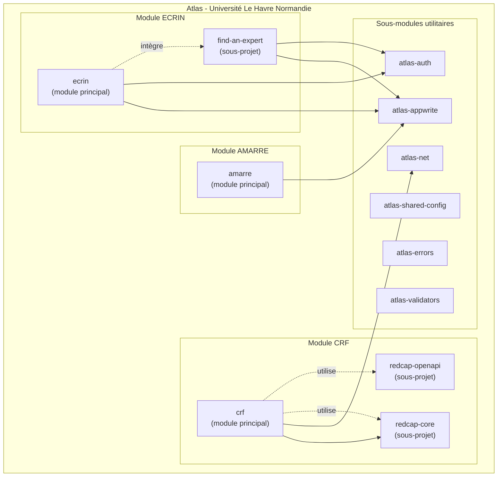

# Atlas

[](https://doi.org/10.5281/zenodo.18310357)

**Atlas** est un monorepo TypeScript développé par l'**Université Le Havre Normandie** pour soutenir la recherche et faciliter la collaboration entre chercheurs.

## Modules principaux

Atlas est composé de **trois modules majeurs** :

| Module | Description | Sous-projets |
|--------|-------------|--------------|
| **ECRIN** | Plateforme de collaboration pour chercheurs | find-an-expert |
| **AMARRE** | Visualisation et analyse de réseaux de recherche | - |
| **CRF** | Outils pour interagir avec REDCap | redcap-core, redcap-openapi |

### ECRIN

ECRIN est une plateforme de collaboration pour chercheurs permettant de présenter ses travaux, trouver des collaborateurs et visualiser les réseaux de recherche. Elle est organisée autour de 6 cartes fonctionnelles : Introduce, Collaborate, Explore, Ask, Publish, Administrate.

**Sous-projet :**
- **find-an-expert** : découverte d'expertise via les publications (OpenAlex) et contributions (GitHub)

### AMARRE

AMARRE est une application de visualisation et d'analyse de réseaux de recherche utilisant des graphes interactifs (Sigma.js, Graphology).

### CRF (Case Report Form)

CRF fournit des outils TypeScript pour interagir avec l'API REDCap de manière sécurisée et typée.

**Sous-projets :**
- **redcap-core** : logique métier REDCap pure avec Effect
- **redcap-openapi** : extraction et analyse de spécifications OpenAPI depuis le code source REDCap

## Architecture



## Packages

### Modules principaux

| Package | Description |
| ------- | ----------- |
| [ecrin](packages/ecrin) | Module ECRIN - plateforme de collaboration chercheurs |
| [amarre](packages/amarre) | Module AMARRE - visualisation de réseaux de recherche |
| [@univ-lehavre/crf](packages/crf) | Module CRF - client, serveur et CLI REDCap |

### Sous-projets

| Package | Module parent | Description |
| ------- | ------------- | ----------- |
| [find-an-expert](packages/find-an-expert) | ECRIN | Découverte d'expertise via publications et GitHub |
| [@univ-lehavre/atlas-redcap-core](packages/redcap-core) | CRF | Logique métier REDCap avec Effect |
| [@univ-lehavre/atlas-redcap-openapi](packages/redcap-openapi) | CRF | Extraction OpenAPI depuis REDCap |

### Sous-modules utilitaires

| Package | Description |
| ------- | ----------- |
| [@univ-lehavre/atlas-net](packages/net) | Utilitaires de diagnostic réseau |
| [@univ-lehavre/atlas-appwrite](packages/appwrite) | Client Appwrite partagé |
| [@univ-lehavre/atlas-auth](packages/auth) | Service d'authentification |
| [@univ-lehavre/atlas-errors](packages/errors) | Classes d'erreurs partagées |
| [@univ-lehavre/atlas-validators](packages/validators) | Utilitaires de validation |
| [@univ-lehavre/atlas-shared-config](packages/shared-config) | Configuration ESLint, TypeScript, Prettier |

## Plateformes tierces

Atlas s'appuie sur deux plateformes tierces :

### REDCap (Research Electronic Data Capture)

[REDCap](https://project-redcap.org/) est une application web sécurisée développée par l'Université Vanderbilt pour la création et la gestion d'enquêtes en ligne et de bases de données de recherche. REDCap est utilisé par plus de **8 000 institutions** dans **164 pays** et a été cité dans plus de **51 000 articles scientifiques**.

REDCap permet la collecte de données sur le web et sur mobile (y compris hors connexion) tout en respectant les réglementations sur la protection des données (RGPD, HIPAA, 21 CFR Part 11). Il est gratuit pour les organisations à but non lucratif membres du Consortium REDCap.

### Appwrite

[Appwrite](https://appwrite.io/) est une plateforme backend open source fournissant les services essentiels pour le développement d'applications web et mobiles : authentification, base de données, stockage et fonctions serverless.

Appwrite est conforme aux normes SOC-2, RGPD et HIPAA. Les modules ECRIN et AMARRE utilisent Appwrite pour l'authentification et la gestion des données utilisateurs.

## Projets institutionnels

Atlas est développé dans le cadre de deux projets portés par l'Université Le Havre Normandie :

### Campus Polytechnique des Territoires Maritimes et Portuaires

Programme de recherche et de formation centré sur les enjeux maritimes et portuaires du territoire havrais et normand.

### EUNICoast

[EUNICoast](https://eunicoast.eu/) est une alliance universitaire européenne regroupant des établissements d'enseignement supérieur situés sur les zones côtières européennes.

## Documentation

- [Guide de démarrage](https://univ-lehavre.github.io/atlas/guide/)
- [Référence API](https://univ-lehavre.github.io/atlas/api/)
- [Audit de la documentation](https://univ-lehavre.github.io/atlas/guide/audit/documentation-audit)
- [Audit ECRIN](https://univ-lehavre.github.io/atlas/guide/audit/ecrin-audit)

## Démarrage rapide

### Utiliser le client API REDCap

```bash
pnpm add @univ-lehavre/atlas-redcap-api effect
```

```typescript
import { Effect } from 'effect';
import { createRedcapClient, RedcapUrl, RedcapToken } from '@univ-lehavre/atlas-redcap-api';

const client = createRedcapClient({
  url: RedcapUrl('https://redcap.example.com/api/'),
  token: RedcapToken('YOUR_32_CHAR_HEXADECIMAL_TOKEN'),
});

const records = await Effect.runPromise(client.exportRecords({ fields: ['record_id', 'name'] }));
```

## Développement

```bash
# Installation
pnpm install

# Développement
pnpm dev

# Tests
pnpm test

# Vérifications pré-release
pnpm ready
```

## Partenaires et financeurs

<p align="center">
  <a href="https://www.univ-lehavre.fr/">
    
  </a>
  &nbsp;&nbsp;&nbsp;&nbsp;
  <a href="https://www.cptmp.fr/">
    
  </a>
  &nbsp;&nbsp;&nbsp;&nbsp;
  <a href="https://eunicoast.eu/">
    
  </a>
</p>

<p align="center">
  
  &nbsp;&nbsp;&nbsp;&nbsp;
  
</p>

## Licence

[MIT](LICENSE)
