Cette page liste **tous les paquets du monorepo** : leur rôle, leur catégorie,
et leurs dépendances internes — qui consomme quoi. Elle répond à la question
« pour comprendre un paquet, lesquels dois-je lire ? ».

> **Page générée.** Le contenu ci-dessous est dérivé des `package.json` par
> `scripts/docs/generate-packages-map.mjs`. Ne l'éditez pas à la main : lancez
> `pnpm docs:generate` après un changement de dépendances. La fraîcheur est
> vérifiée en CI (plan « Documentation vérifiable »).

Pour la vue d'ensemble par catégorie et les règles transverses, voir
[la structure du monorepo](./monorepo).

<!-- AUTO-GENERATED:packages-map START -->

### Applications (`apps/`)

| Paquet                                                        | Rôle                                                                                                   | Dépend de                                                                                                                                                                                                                                                                                                                                                                                                                                                                                                                                                            | Consommé par |
| ------------------------------------------------------------- | ------------------------------------------------------------------------------------------------------ | -------------------------------------------------------------------------------------------------------------------------------------------------------------------------------------------------------------------------------------------------------------------------------------------------------------------------------------------------------------------------------------------------------------------------------------------------------------------------------------------------------------------------------------------------------------------- | ------------ |
| [`atlas-amarre`](/atlas/packages/apps/amarre)                 | Application de gestion des conventions.                                                                | [`atlas-auth`](/atlas/packages/packages/auth), [`atlas-baas`](/atlas/packages/packages/baas), [`atlas-errors`](/atlas/packages/packages/errors), [`atlas-logos-cli`](/atlas/packages/cli/logos), [`atlas-shared-config`](/atlas/packages/config/shared-config), [`atlas-sveltekit-csp`](/atlas/packages/packages/sveltekit-csp), [`atlas-sveltekit-handler`](/atlas/packages/packages/sveltekit-handler), `atlas-test-utils-sveltekit`, [`atlas-ui`](/atlas/packages/ui/atlas-ui), [`atlas-validators`](/atlas/packages/packages/validators)                         | —            |
| [`atlas-crf-dashboard`](/atlas/packages/apps/crf-dashboard)   | Tableau de bord interne — vue d'ensemble des dictionnaires REDCap et de leur conformité.               | [`atlas-crf-logs`](/atlas/packages/packages/crf-logs), [`atlas-shared-config`](/atlas/packages/config/shared-config), [`atlas-sveltekit-csp`](/atlas/packages/packages/sveltekit-csp)                                                                                                                                                                                                                                                                                                                                                                                | —            |
| [`atlas-dashboard`](/atlas/packages/apps/atlas-dashboard)     | Internal dashboard tracking npm and GitHub stats (releases, downloads) of the published Atlas packages | [`atlas-shared-config`](/atlas/packages/config/shared-config), [`atlas-stats`](/atlas/packages/packages/atlas-stats), [`atlas-sveltekit-csp`](/atlas/packages/packages/sveltekit-csp)                                                                                                                                                                                                                                                                                                                                                                                | —            |
| [`atlas-ecrin`](/atlas/packages/apps/ecrin)                   | Application de gestion des projets et de leurs dossiers d'avis éthiques.                               | [`atlas-auth`](/atlas/packages/packages/auth), [`atlas-baas`](/atlas/packages/packages/baas), [`atlas-errors`](/atlas/packages/packages/errors), [`atlas-logos-cli`](/atlas/packages/cli/logos), [`atlas-shared-config`](/atlas/packages/config/shared-config), [`atlas-sveltekit-csp`](/atlas/packages/packages/sveltekit-csp), [`atlas-sveltekit-handler`](/atlas/packages/packages/sveltekit-handler), `atlas-test-utils-sveltekit`, [`atlas-validators`](/atlas/packages/packages/validators)                                                                    | —            |
| [`atlas-find-an-expert`](/atlas/packages/apps/find-an-expert) | Outil de recherche d'expertise, basé sur l'agrégation des publications via OpenAlex.                   | [`atlas-auth`](/atlas/packages/packages/auth), [`atlas-baas`](/atlas/packages/packages/baas), [`atlas-citation-fetch`](/atlas/packages/packages/citation-fetch), [`atlas-errors`](/atlas/packages/packages/errors), [`atlas-logos-cli`](/atlas/packages/cli/logos), [`atlas-shared-config`](/atlas/packages/config/shared-config), [`atlas-sveltekit-csp`](/atlas/packages/packages/sveltekit-csp), [`atlas-sveltekit-handler`](/atlas/packages/packages/sveltekit-handler), `atlas-test-utils-sveltekit`, [`atlas-validators`](/atlas/packages/packages/validators) | —            |
| [`atlas-sillage`](/atlas/packages/apps/sillage)               | Plateforme communautaire de mise en relation autour de projets ECRIN.                                  | [`atlas-auth`](/atlas/packages/packages/auth), [`atlas-baas`](/atlas/packages/packages/baas), [`atlas-errors`](/atlas/packages/packages/errors), [`atlas-shared-config`](/atlas/packages/config/shared-config), [`atlas-sveltekit-csp`](/atlas/packages/packages/sveltekit-csp), [`atlas-ui`](/atlas/packages/ui/atlas-ui), [`atlas-validators`](/atlas/packages/packages/validators)                                                                                                                                                                                | —            |

### Services (`services/`)

| Paquet                                      | Rôle                                                        | Dépend de                                                                                                                | Consommé par                               |
| ------------------------------------------- | ----------------------------------------------------------- | ------------------------------------------------------------------------------------------------------------------------ | ------------------------------------------ |
| [`atlas-crf`](/atlas/packages/services/crf) | CRF Service - HTTP microservice for complex reporting forms | [`atlas-crf-client`](/atlas/packages/packages/crf-client), [`atlas-shared-config`](/atlas/packages/config/shared-config) | [`atlas-crf-cli`](/atlas/packages/cli/crf) |

### Bibliothèques (`packages/`)

| Paquet                                                                        | Rôle                                                                                                                          | Dépend de                                                                                                                                                                                                                                                                      | Consommé par                                                                                                                                                                                                                                                                                                                                                                                                                                 |
| ----------------------------------------------------------------------------- | ----------------------------------------------------------------------------------------------------------------------------- | ------------------------------------------------------------------------------------------------------------------------------------------------------------------------------------------------------------------------------------------------------------------------------ | -------------------------------------------------------------------------------------------------------------------------------------------------------------------------------------------------------------------------------------------------------------------------------------------------------------------------------------------------------------------------------------------------------------------------------------------- |
| [`atlas-auth`](/atlas/packages/packages/auth)                                 | Shared authentication service for Atlas SvelteKit applications                                                                | [`atlas-baas`](/atlas/packages/packages/baas), [`atlas-errors`](/atlas/packages/packages/errors), [`atlas-shared-config`](/atlas/packages/config/shared-config), [`atlas-validators`](/atlas/packages/packages/validators)                                                     | [`atlas-amarre`](/atlas/packages/apps/amarre), [`atlas-ecrin`](/atlas/packages/apps/ecrin), [`atlas-find-an-expert`](/atlas/packages/apps/find-an-expert), [`atlas-sillage`](/atlas/packages/apps/sillage)                                                                                                                                                                                                                                   |
| [`atlas-baas`](/atlas/packages/packages/baas)                                 | Shared Backend-as-a-Service (Appwrite) client utilities for Atlas applications                                                | [`atlas-errors`](/atlas/packages/packages/errors), [`atlas-shared-config`](/atlas/packages/config/shared-config)                                                                                                                                                               | [`atlas-amarre`](/atlas/packages/apps/amarre), [`atlas-auth`](/atlas/packages/packages/auth), [`atlas-ecrin`](/atlas/packages/apps/ecrin), [`atlas-find-an-expert`](/atlas/packages/apps/find-an-expert), [`atlas-sillage`](/atlas/packages/apps/sillage)                                                                                                                                                                                    |
| [`atlas-citation`](/atlas/packages/packages/citation)                         | OpenAlex citation graph data mining library with DuckDB, ML embeddings, and string grouping                                   | [`atlas-fetch-one-api-page`](/atlas/packages/packages/fetch-one-api-page), [`atlas-shared-config`](/atlas/packages/config/shared-config)                                                                                                                                       | [`atlas-citation-cli`](/atlas/packages/cli/citation)                                                                                                                                                                                                                                                                                                                                                                                         |
| [`atlas-citation-fetch`](/atlas/packages/packages/citation-fetch)             | Paginated fetch client for the OpenAlex citation graph API with rate limiting and queue-based state                           | [`atlas-citation-types`](/atlas/packages/packages/citation-types), [`atlas-fetch-one-api-page`](/atlas/packages/packages/fetch-one-api-page), [`atlas-shared-config`](/atlas/packages/config/shared-config)                                                                    | [`atlas-citation-validate`](/atlas/packages/packages/citation-validate), [`atlas-find-an-expert`](/atlas/packages/apps/find-an-expert), [`atlas-researcher-profiles`](/atlas/packages/packages/researcher-profiles), [`atlas-researcher-profiles-cli`](/atlas/packages/cli/researcher-profiles)                                                                                                                                              |
| [`atlas-citation-types`](/atlas/packages/packages/citation-types)             | TypeScript types and branded types for the OpenAlex citation graph API                                                        | [`atlas-shared-config`](/atlas/packages/config/shared-config)                                                                                                                                                                                                                  | [`atlas-biblio-cli`](/atlas/packages/cli/biblio), [`atlas-citation-fetch`](/atlas/packages/packages/citation-fetch), [`atlas-citation-validate`](/atlas/packages/packages/citation-validate), [`atlas-researcher-profiles`](/atlas/packages/packages/researcher-profiles), [`atlas-researcher-profiles-cli`](/atlas/packages/cli/researcher-profiles)                                                                                        |
| [`atlas-citation-validate`](/atlas/packages/packages/citation-validate)       | CLI tools for OpenAlex bibliographic data validation and reliability                                                          | [`atlas-citation-fetch`](/atlas/packages/packages/citation-fetch), [`atlas-citation-types`](/atlas/packages/packages/citation-types), [`atlas-fetch-one-api-page`](/atlas/packages/packages/fetch-one-api-page), [`atlas-shared-config`](/atlas/packages/config/shared-config) | [`atlas-biblio-cli`](/atlas/packages/cli/biblio)                                                                                                                                                                                                                                                                                                                                                                                             |
| [`atlas-cli-toolkit`](/atlas/packages/packages/cli-toolkit)                   | Framework-agnostic CLI boilerplate for the atlas monorepo: env reading, argv flag parsing and fatal-error/exit-code handling. | [`atlas-shared-config`](/atlas/packages/config/shared-config)                                                                                                                                                                                                                  | [`atlas-biblio-cli`](/atlas/packages/cli/biblio), [`atlas-citation-cli`](/atlas/packages/cli/citation), [`atlas-researcher-profiles-cli`](/atlas/packages/cli/researcher-profiles)                                                                                                                                                                                                                                                           |
| [`atlas-crf-client`](/atlas/packages/packages/crf-client)                     | Complex reporting form (CRF) API client for Atlas - Effect-based typed client                                                 | [`atlas-crf-core`](/atlas/packages/packages/crf-core), [`atlas-net`](/atlas/packages/packages/net), [`atlas-shared-config`](/atlas/packages/config/shared-config)                                                                                                              | [`atlas-crf`](/atlas/packages/services/crf), [`atlas-crf-cli`](/atlas/packages/cli/crf), [`atlas-researcher-profiles`](/atlas/packages/packages/researcher-profiles)                                                                                                                                                                                                                                                                         |
| [`atlas-crf-core`](/atlas/packages/packages/crf-core)                         | Pure functional core for Complex reporting form (CRF) domain logic with Effect                                                | [`atlas-shared-config`](/atlas/packages/config/shared-config)                                                                                                                                                                                                                  | [`atlas-crf-client`](/atlas/packages/packages/crf-client), [`atlas-crf-fixtures`](/atlas/packages/packages/crf-fixtures), [`atlas-crf-openapi`](/atlas/packages/cli/crf-openapi), [`atlas-crf-project-template`](/atlas/packages/packages/crf-project-template)                                                                                                                                                                              |
| [`atlas-crf-fixtures`](/atlas/packages/packages/crf-fixtures)                 | CRF data-dictionary CSV parser and deterministic fake-record generator for tests and fixtures in the atlas monorepo.          | [`atlas-crf-core`](/atlas/packages/packages/crf-core), [`atlas-shared-config`](/atlas/packages/config/shared-config)                                                                                                                                                           | —                                                                                                                                                                                                                                                                                                                                                                                                                                            |
| [`atlas-crf-logs`](/atlas/packages/packages/crf-logs)                         | Complex reporting form (CRF) audit log fetching, enrichment and rolling-window analytics                                      | [`atlas-shared-config`](/atlas/packages/config/shared-config)                                                                                                                                                                                                                  | [`atlas-crf-dashboard`](/atlas/packages/apps/crf-dashboard), [`atlas-crf-stats-cli`](/atlas/packages/cli/crf-stats)                                                                                                                                                                                                                                                                                                                          |
| [`atlas-crf-project-template`](/atlas/packages/packages/crf-project-template) | Declarative, typed CRF project template (instruments, fields, metadata) built with Effect Schema.                             | [`atlas-crf-core`](/atlas/packages/packages/crf-core), [`atlas-shared-config`](/atlas/packages/config/shared-config)                                                                                                                                                           | —                                                                                                                                                                                                                                                                                                                                                                                                                                            |
| [`atlas-errors`](/atlas/packages/packages/errors)                             | Shared error classes for Atlas applications                                                                                   | [`atlas-shared-config`](/atlas/packages/config/shared-config)                                                                                                                                                                                                                  | [`atlas-amarre`](/atlas/packages/apps/amarre), [`atlas-auth`](/atlas/packages/packages/auth), [`atlas-baas`](/atlas/packages/packages/baas), [`atlas-ecrin`](/atlas/packages/apps/ecrin), [`atlas-find-an-expert`](/atlas/packages/apps/find-an-expert), [`atlas-sillage`](/atlas/packages/apps/sillage), [`atlas-sveltekit-handler`](/atlas/packages/packages/sveltekit-handler), [`atlas-validators`](/atlas/packages/packages/validators) |
| [`atlas-fetch-one-api-page`](/atlas/packages/packages/fetch-one-api-page)     | A monadic API fetch library for paginated requests                                                                            | [`atlas-shared-config`](/atlas/packages/config/shared-config)                                                                                                                                                                                                                  | [`atlas-citation`](/atlas/packages/packages/citation), [`atlas-citation-fetch`](/atlas/packages/packages/citation-fetch), [`atlas-citation-validate`](/atlas/packages/packages/citation-validate)                                                                                                                                                                                                                                            |
| [`atlas-net`](/atlas/packages/packages/net)                                   | Network diagnostic utilities for Atlas                                                                                        | [`atlas-shared-config`](/atlas/packages/config/shared-config)                                                                                                                                                                                                                  | [`atlas-crf-client`](/atlas/packages/packages/crf-client), [`atlas-net-cli`](/atlas/packages/cli/net)                                                                                                                                                                                                                                                                                                                                        |
| [`atlas-researcher-profiles`](/atlas/packages/packages/researcher-profiles)   | Researcher profiles service layer: REDCap/CSV ingestion, OpenAlex matching, PDF/reference extraction                          | [`atlas-citation-fetch`](/atlas/packages/packages/citation-fetch), [`atlas-citation-types`](/atlas/packages/packages/citation-types), [`atlas-crf-client`](/atlas/packages/packages/crf-client), [`atlas-shared-config`](/atlas/packages/config/shared-config)                 | [`atlas-researcher-profiles-cli`](/atlas/packages/cli/researcher-profiles)                                                                                                                                                                                                                                                                                                                                                                   |
| [`atlas-stats`](/atlas/packages/packages/atlas-stats)                         | GitHub releases and npm package stats fetching, caching and computation for the Atlas monorepo                                | [`atlas-shared-config`](/atlas/packages/config/shared-config)                                                                                                                                                                                                                  | [`atlas-dashboard`](/atlas/packages/apps/atlas-dashboard), [`atlas-stats-cli`](/atlas/packages/cli/atlas-stats)                                                                                                                                                                                                                                                                                                                              |
| [`atlas-sveltekit-csp`](/atlas/packages/packages/sveltekit-csp)               | Shared Content-Security-Policy directives and security headers helpers for SvelteKit apps in the atlas monorepo.              | [`atlas-shared-config`](/atlas/packages/config/shared-config)                                                                                                                                                                                                                  | [`atlas-amarre`](/atlas/packages/apps/amarre), [`atlas-crf-dashboard`](/atlas/packages/apps/crf-dashboard), [`atlas-dashboard`](/atlas/packages/apps/atlas-dashboard), [`atlas-ecrin`](/atlas/packages/apps/ecrin), [`atlas-find-an-expert`](/atlas/packages/apps/find-an-expert), [`atlas-sillage`](/atlas/packages/apps/sillage)                                                                                                           |
| [`atlas-sveltekit-handler`](/atlas/packages/packages/sveltekit-handler)       | Shared SvelteKit `+server.ts` handler wrapper (try/catch + uniform error mapping) for the atlas monorepo.                     | [`atlas-errors`](/atlas/packages/packages/errors), [`atlas-shared-config`](/atlas/packages/config/shared-config), `atlas-test-utils-sveltekit`                                                                                                                                 | [`atlas-amarre`](/atlas/packages/apps/amarre), [`atlas-ecrin`](/atlas/packages/apps/ecrin), [`atlas-find-an-expert`](/atlas/packages/apps/find-an-expert)                                                                                                                                                                                                                                                                                    |
| `atlas-test-utils-sveltekit`                                                  | Shared SvelteKit endpoint test helpers (route-event builder, anti-XSS assertion) for the atlas monorepo.                      | [`atlas-shared-config`](/atlas/packages/config/shared-config)                                                                                                                                                                                                                  | [`atlas-amarre`](/atlas/packages/apps/amarre), [`atlas-ecrin`](/atlas/packages/apps/ecrin), [`atlas-find-an-expert`](/atlas/packages/apps/find-an-expert), [`atlas-sveltekit-handler`](/atlas/packages/packages/sveltekit-handler)                                                                                                                                                                                                           |
| [`atlas-validators`](/atlas/packages/packages/validators)                     | Shared validation utilities for Atlas applications                                                                            | [`atlas-errors`](/atlas/packages/packages/errors), [`atlas-shared-config`](/atlas/packages/config/shared-config)                                                                                                                                                               | [`atlas-amarre`](/atlas/packages/apps/amarre), [`atlas-auth`](/atlas/packages/packages/auth), [`atlas-ecrin`](/atlas/packages/apps/ecrin), [`atlas-find-an-expert`](/atlas/packages/apps/find-an-expert), [`atlas-sillage`](/atlas/packages/apps/sillage), [`atlas-ui`](/atlas/packages/ui/atlas-ui)                                                                                                                                         |

### Outils en ligne de commande (`cli/`)

| Paquet                                                                     | Rôle                                                                                               | Dépend de                                                                                                                                                                                                                                                                                                                                     | Consommé par                                                                                                                                              |
| -------------------------------------------------------------------------- | -------------------------------------------------------------------------------------------------- | --------------------------------------------------------------------------------------------------------------------------------------------------------------------------------------------------------------------------------------------------------------------------------------------------------------------------------------------- | --------------------------------------------------------------------------------------------------------------------------------------------------------- |
| [`atlas-biblio-cli`](/atlas/packages/cli/biblio)                           | CLI entry point for OpenAlex bibliographic data validation                                         | [`atlas-citation-types`](/atlas/packages/packages/citation-types), [`atlas-citation-validate`](/atlas/packages/packages/citation-validate), [`atlas-cli-toolkit`](/atlas/packages/packages/cli-toolkit), [`atlas-shared-config`](/atlas/packages/config/shared-config)                                                                        | —                                                                                                                                                         |
| [`atlas-citation-cli`](/atlas/packages/cli/citation)                       | CLI for OpenAlex citation graph researcher data curation                                           | [`atlas-citation`](/atlas/packages/packages/citation), [`atlas-cli-toolkit`](/atlas/packages/packages/cli-toolkit), [`atlas-shared-config`](/atlas/packages/config/shared-config)                                                                                                                                                             | —                                                                                                                                                         |
| [`atlas-crf-cli`](/atlas/packages/cli/crf)                                 | CRF CLI - REDCap connectivity test and CRF server management                                       | [`atlas-crf`](/atlas/packages/services/crf), [`atlas-crf-client`](/atlas/packages/packages/crf-client), [`atlas-shared-config`](/atlas/packages/config/shared-config)                                                                                                                                                                         | —                                                                                                                                                         |
| [`atlas-crf-openapi`](/atlas/packages/cli/crf-openapi)                     | Complex reporting form (CRF) source analysis, OpenAPI spec extraction, and API documentation tools | [`atlas-crf-core`](/atlas/packages/packages/crf-core), [`atlas-shared-config`](/atlas/packages/config/shared-config)                                                                                                                                                                                                                          | —                                                                                                                                                         |
| [`atlas-crf-stats-cli`](/atlas/packages/cli/crf-stats)                     | CLI to test CRF (REDCap) project tokens and inspect API responses                                  | [`atlas-crf-logs`](/atlas/packages/packages/crf-logs), [`atlas-shared-config`](/atlas/packages/config/shared-config)                                                                                                                                                                                                                          | —                                                                                                                                                         |
| [`atlas-logos-cli`](/atlas/packages/cli/logos)                             | CLI to copy Atlas logo assets into a target directory (typically a SvelteKit app's static/ folder) | [`atlas-logos`](/atlas/packages/assets/logos)                                                                                                                                                                                                                                                                                                 | [`atlas-amarre`](/atlas/packages/apps/amarre), [`atlas-ecrin`](/atlas/packages/apps/ecrin), [`atlas-find-an-expert`](/atlas/packages/apps/find-an-expert) |
| [`atlas-net-cli`](/atlas/packages/cli/net)                                 | Network diagnostic CLI for Atlas                                                                   | [`atlas-net`](/atlas/packages/packages/net), [`atlas-shared-config`](/atlas/packages/config/shared-config)                                                                                                                                                                                                                                    | —                                                                                                                                                         |
| [`atlas-researcher-profiles-cli`](/atlas/packages/cli/researcher-profiles) | Researcher profiles CLI: fetch OpenAlex works from CSV or REDCap and write to REDCap               | [`atlas-citation-fetch`](/atlas/packages/packages/citation-fetch), [`atlas-citation-types`](/atlas/packages/packages/citation-types), [`atlas-cli-toolkit`](/atlas/packages/packages/cli-toolkit), [`atlas-researcher-profiles`](/atlas/packages/packages/researcher-profiles), [`atlas-shared-config`](/atlas/packages/config/shared-config) | —                                                                                                                                                         |
| [`atlas-stats-cli`](/atlas/packages/cli/atlas-stats)                       | CLI interactif pour visualiser les statistiques GitHub et npm du dépôt Atlas                       | [`atlas-shared-config`](/atlas/packages/config/shared-config), [`atlas-stats`](/atlas/packages/packages/atlas-stats)                                                                                                                                                                                                                          | —                                                                                                                                                         |

### Interface partagée (`ui/`)

| Paquet                                    | Rôle                                                                         | Dépend de                                                                                                                | Consommé par                                                                                   |
| ----------------------------------------- | ---------------------------------------------------------------------------- | ------------------------------------------------------------------------------------------------------------------------ | ---------------------------------------------------------------------------------------------- |
| [`atlas-ui`](/atlas/packages/ui/atlas-ui) | Shared Svelte UI components for the atlas monorepo, previewed via Storybook. | [`atlas-shared-config`](/atlas/packages/config/shared-config), [`atlas-validators`](/atlas/packages/packages/validators) | [`atlas-amarre`](/atlas/packages/apps/amarre), [`atlas-sillage`](/atlas/packages/apps/sillage) |

### Configuration (`config/`)

| Paquet                                                        | Rôle                                                                     | Dépend de | Consommé par                                                                                                                                                                                                                                                                                                                                                                                                                                                                                                                                                                                                                                                                                                                                                                                                                                                                                                                                                                                                                                                                                                                                                                                                                                                                                                                                                                                                                                                                                                                                                                                                                                                                                                                                                                                                                                                                                                                                                                                                                                                                                                                                                                                                                                                                                                                                                                             |
| ------------------------------------------------------------- | ------------------------------------------------------------------------ | --------- | ---------------------------------------------------------------------------------------------------------------------------------------------------------------------------------------------------------------------------------------------------------------------------------------------------------------------------------------------------------------------------------------------------------------------------------------------------------------------------------------------------------------------------------------------------------------------------------------------------------------------------------------------------------------------------------------------------------------------------------------------------------------------------------------------------------------------------------------------------------------------------------------------------------------------------------------------------------------------------------------------------------------------------------------------------------------------------------------------------------------------------------------------------------------------------------------------------------------------------------------------------------------------------------------------------------------------------------------------------------------------------------------------------------------------------------------------------------------------------------------------------------------------------------------------------------------------------------------------------------------------------------------------------------------------------------------------------------------------------------------------------------------------------------------------------------------------------------------------------------------------------------------------------------------------------------------------------------------------------------------------------------------------------------------------------------------------------------------------------------------------------------------------------------------------------------------------------------------------------------------------------------------------------------------------------------------------------------------------------------------------------------------- |
| [`atlas-shared-config`](/atlas/packages/config/shared-config) | Shared TypeScript, ESLint, and Prettier configuration for Atlas projects | —         | [`atlas-amarre`](/atlas/packages/apps/amarre), [`atlas-amarre-sandbox`](/atlas/packages/sandbox/amarre-sandbox), [`atlas-auth`](/atlas/packages/packages/auth), [`atlas-baas`](/atlas/packages/packages/baas), [`atlas-biblio-cli`](/atlas/packages/cli/biblio), [`atlas-citation`](/atlas/packages/packages/citation), [`atlas-citation-cli`](/atlas/packages/cli/citation), [`atlas-citation-fetch`](/atlas/packages/packages/citation-fetch), [`atlas-citation-types`](/atlas/packages/packages/citation-types), [`atlas-citation-validate`](/atlas/packages/packages/citation-validate), [`atlas-cli-toolkit`](/atlas/packages/packages/cli-toolkit), [`atlas-crf`](/atlas/packages/services/crf), [`atlas-crf-cli`](/atlas/packages/cli/crf), [`atlas-crf-client`](/atlas/packages/packages/crf-client), [`atlas-crf-core`](/atlas/packages/packages/crf-core), [`atlas-crf-dashboard`](/atlas/packages/apps/crf-dashboard), [`atlas-crf-fixtures`](/atlas/packages/packages/crf-fixtures), [`atlas-crf-logs`](/atlas/packages/packages/crf-logs), [`atlas-crf-openapi`](/atlas/packages/cli/crf-openapi), [`atlas-crf-project-template`](/atlas/packages/packages/crf-project-template), [`atlas-crf-sandbox`](/atlas/packages/sandbox/crf-sandbox), [`atlas-crf-stats-cli`](/atlas/packages/cli/crf-stats), [`atlas-dashboard`](/atlas/packages/apps/atlas-dashboard), [`atlas-ecrin`](/atlas/packages/apps/ecrin), [`atlas-errors`](/atlas/packages/packages/errors), [`atlas-fetch-one-api-page`](/atlas/packages/packages/fetch-one-api-page), [`atlas-find-an-expert`](/atlas/packages/apps/find-an-expert), [`atlas-net`](/atlas/packages/packages/net), [`atlas-net-cli`](/atlas/packages/cli/net), [`atlas-researcher-profiles`](/atlas/packages/packages/researcher-profiles), [`atlas-researcher-profiles-cli`](/atlas/packages/cli/researcher-profiles), [`atlas-sillage`](/atlas/packages/apps/sillage), [`atlas-sillage-sandbox`](/atlas/packages/sandbox/sillage-sandbox), [`atlas-stats`](/atlas/packages/packages/atlas-stats), [`atlas-stats-cli`](/atlas/packages/cli/atlas-stats), [`atlas-sveltekit-csp`](/atlas/packages/packages/sveltekit-csp), [`atlas-sveltekit-handler`](/atlas/packages/packages/sveltekit-handler), `atlas-test-utils-sveltekit`, [`atlas-ui`](/atlas/packages/ui/atlas-ui), [`atlas-validators`](/atlas/packages/packages/validators) |

### Ressources (`assets/`)

| Paquet                                        | Rôle                                      | Dépend de | Consommé par                                   |
| --------------------------------------------- | ----------------------------------------- | --------- | ---------------------------------------------- |
| [`atlas-logos`](/atlas/packages/assets/logos) | Logos and brand assets for Atlas projects | —         | [`atlas-logos-cli`](/atlas/packages/cli/logos) |

### Bancs d'essai (`sandbox/`)

| Paquet                                                             | Rôle                                                                                                                                                                                                        | Dépend de                                                     | Consommé par |
| ------------------------------------------------------------------ | ----------------------------------------------------------------------------------------------------------------------------------------------------------------------------------------------------------- | ------------------------------------------------------------- | ------------ |
| [`atlas-amarre-sandbox`](/atlas/packages/sandbox/amarre-sandbox)   | Local Docker sandbox for the amarre app: bundles a CRF (REDCap) instance, a self-hosted BaaS (Appwrite), and the wiring scripts needed to run amarre end-to-end without depending on production services.   | [`atlas-shared-config`](/atlas/packages/config/shared-config) | —            |
| [`atlas-crf-sandbox`](/atlas/packages/sandbox/crf-sandbox)         | CRF (REDCap) testing sandbox - Docker environment and contract tests for validating OpenAPI specs                                                                                                           | [`atlas-shared-config`](/atlas/packages/config/shared-config) | —            |
| [`atlas-sillage-sandbox`](/atlas/packages/sandbox/sillage-sandbox) | Local Docker sandbox for the sillage app: bundles a CRF (REDCap) instance, a self-hosted BaaS (Appwrite), and the wiring scripts needed to run sillage end-to-end without depending on production services. | [`atlas-shared-config`](/atlas/packages/config/shared-config) | —            |

## Graphes de dépendances par livrable

Le graphe complet (toutes les dépendances internes d'un coup) est
illisible. On le découpe **par livrable** : chaque application ou outil en
ligne de commande — un paquet que personne d'autre ne consomme — a son
propre graphe, limité à ses **dépendances transitives**. Une flèche
`A --> B` signifie « A dépend de B » (tous champs de dépendances confondus).
Un livrable sans dépendance interne n'a pas de graphe.

### [`atlas-amarre`](/atlas/packages/apps/amarre)

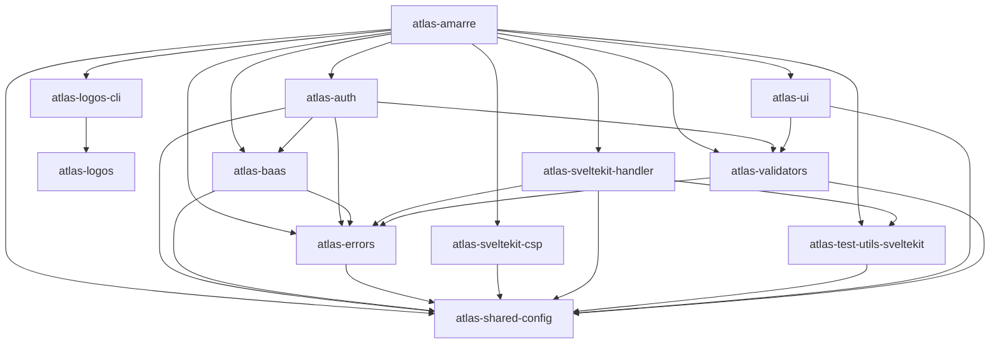

### [`atlas-crf-dashboard`](/atlas/packages/apps/crf-dashboard)

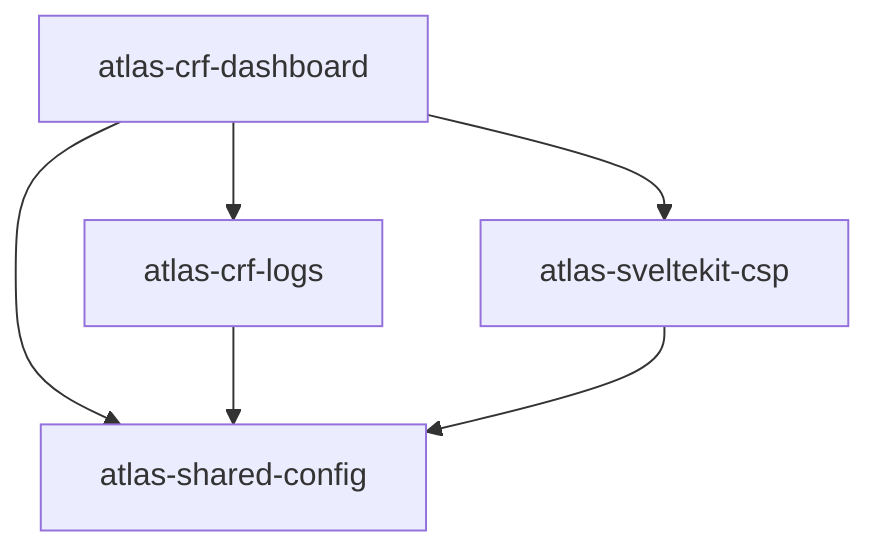

### [`atlas-dashboard`](/atlas/packages/apps/atlas-dashboard)

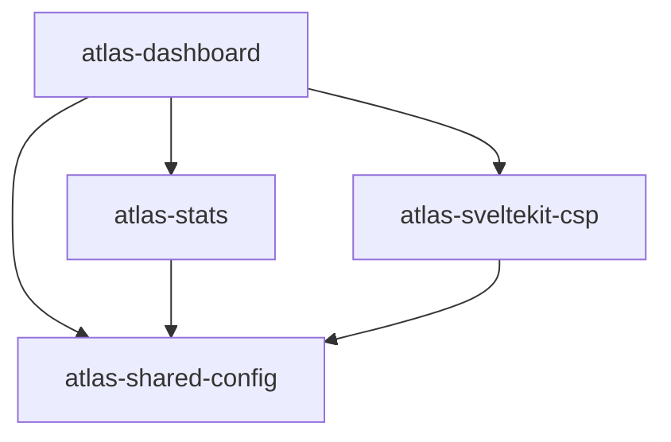

### [`atlas-ecrin`](/atlas/packages/apps/ecrin)

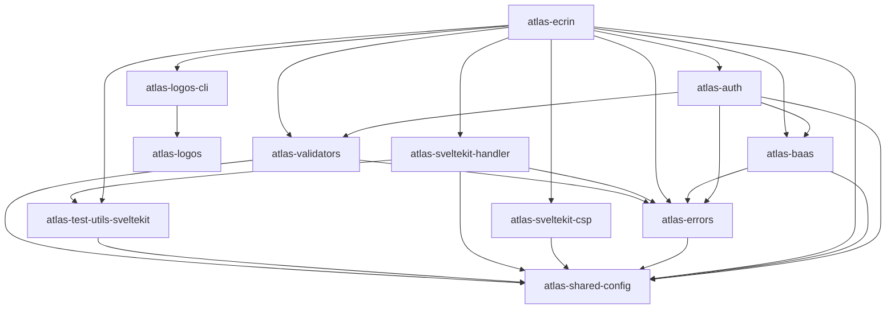

### [`atlas-find-an-expert`](/atlas/packages/apps/find-an-expert)

```mermaid
flowchart TD
  _univ_lehavre_atlas_auth["atlas-auth"]
  _univ_lehavre_atlas_baas["atlas-baas"]
  _univ_lehavre_atlas_citation_fetch["atlas-citation-fetch"]
  _univ_lehavre_atlas_citation_types["atlas-citation-types"]
  _univ_lehavre_atlas_errors["atlas-errors"]
  _univ_lehavre_atlas_fetch_one_api_page["atlas-fetch-one-api-page"]
  _univ_lehavre_atlas_find_an_expert["atlas-find-an-expert"]
  _univ_lehavre_atlas_logos["atlas-logos"]
  _univ_lehavre_atlas_logos_cli["atlas-logos-cli"]
  _univ_lehavre_atlas_shared_config["atlas-shared-config"]
  _univ_lehavre_atlas_sveltekit_csp["atlas-sveltekit-csp"]
  _univ_lehavre_atlas_sveltekit_handler["atlas-sveltekit-handler"]
  _univ_lehavre_atlas_test_utils_sveltekit["atlas-test-utils-sveltekit"]
  _univ_lehavre_atlas_validators["atlas-validators"]
  _univ_lehavre_atlas_auth --> _univ_lehavre_atlas_baas
  _univ_lehavre_atlas_auth --> _univ_lehavre_atlas_errors
  _univ_lehavre_atlas_auth --> _univ_lehavre_atlas_shared_config
  _univ_lehavre_atlas_auth --> _univ_lehavre_atlas_validators
  _univ_lehavre_atlas_baas --> _univ_lehavre_atlas_errors
  _univ_lehavre_atlas_baas --> _univ_lehavre_atlas_shared_config
  _univ_lehavre_atlas_citation_fetch --> _univ_lehavre_atlas_citation_types
  _univ_lehavre_atlas_citation_fetch --> _univ_lehavre_atlas_fetch_one_api_page
  _univ_lehavre_atlas_citation_fetch --> _univ_lehavre_atlas_shared_config
  _univ_lehavre_atlas_citation_types --> _univ_lehavre_atlas_shared_config
  _univ_lehavre_atlas_errors --> _univ_lehavre_atlas_shared_config
  _univ_lehavre_atlas_fetch_one_api_page --> _univ_lehavre_atlas_shared_config
  _univ_lehavre_atlas_find_an_expert --> _univ_lehavre_atlas_auth
  _univ_lehavre_atlas_find_an_expert --> _univ_lehavre_atlas_baas
  _univ_lehavre_atlas_find_an_expert --> _univ_lehavre_atlas_citation_fetch
  _univ_lehavre_atlas_find_an_expert --> _univ_lehavre_atlas_errors
  _univ_lehavre_atlas_find_an_expert --> _univ_lehavre_atlas_logos_cli
  _univ_lehavre_atlas_find_an_expert --> _univ_lehavre_atlas_shared_config
  _univ_lehavre_atlas_find_an_expert --> _univ_lehavre_atlas_sveltekit_csp
  _univ_lehavre_atlas_find_an_expert --> _univ_lehavre_atlas_sveltekit_handler
  _univ_lehavre_atlas_find_an_expert --> _univ_lehavre_atlas_test_utils_sveltekit
  _univ_lehavre_atlas_find_an_expert --> _univ_lehavre_atlas_validators
  _univ_lehavre_atlas_logos_cli --> _univ_lehavre_atlas_logos
  _univ_lehavre_atlas_sveltekit_csp --> _univ_lehavre_atlas_shared_config
  _univ_lehavre_atlas_sveltekit_handler --> _univ_lehavre_atlas_errors
  _univ_lehavre_atlas_sveltekit_handler --> _univ_lehavre_atlas_shared_config
  _univ_lehavre_atlas_sveltekit_handler --> _univ_lehavre_atlas_test_utils_sveltekit
  _univ_lehavre_atlas_test_utils_sveltekit --> _univ_lehavre_atlas_shared_config
  _univ_lehavre_atlas_validators --> _univ_lehavre_atlas_errors
  _univ_lehavre_atlas_validators --> _univ_lehavre_atlas_shared_config
```

### [`atlas-sillage`](/atlas/packages/apps/sillage)

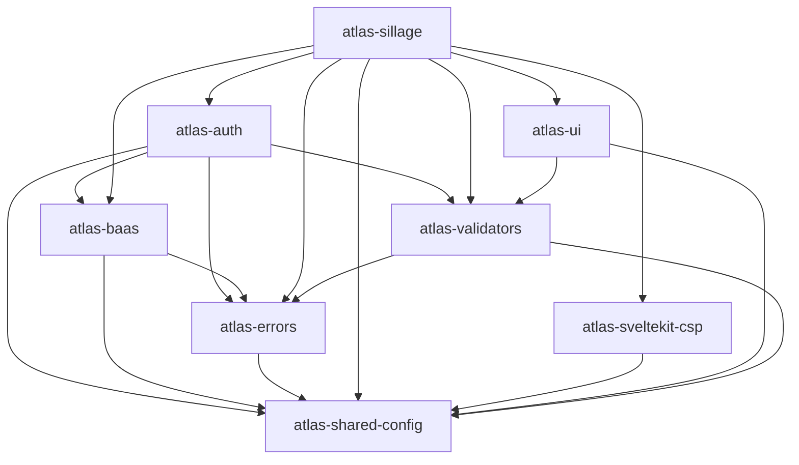

### [`atlas-biblio-cli`](/atlas/packages/cli/biblio)

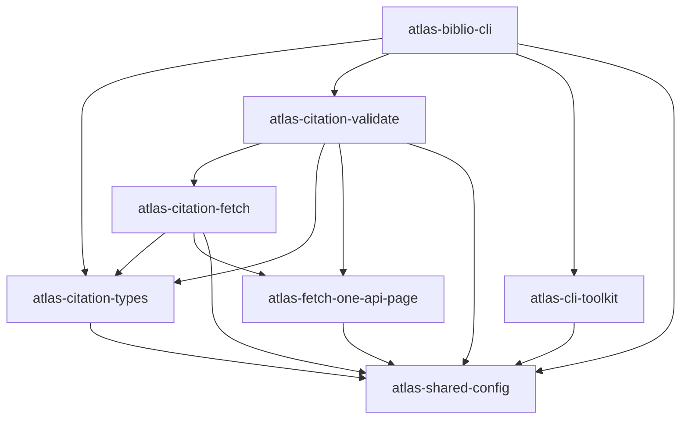

### [`atlas-citation-cli`](/atlas/packages/cli/citation)

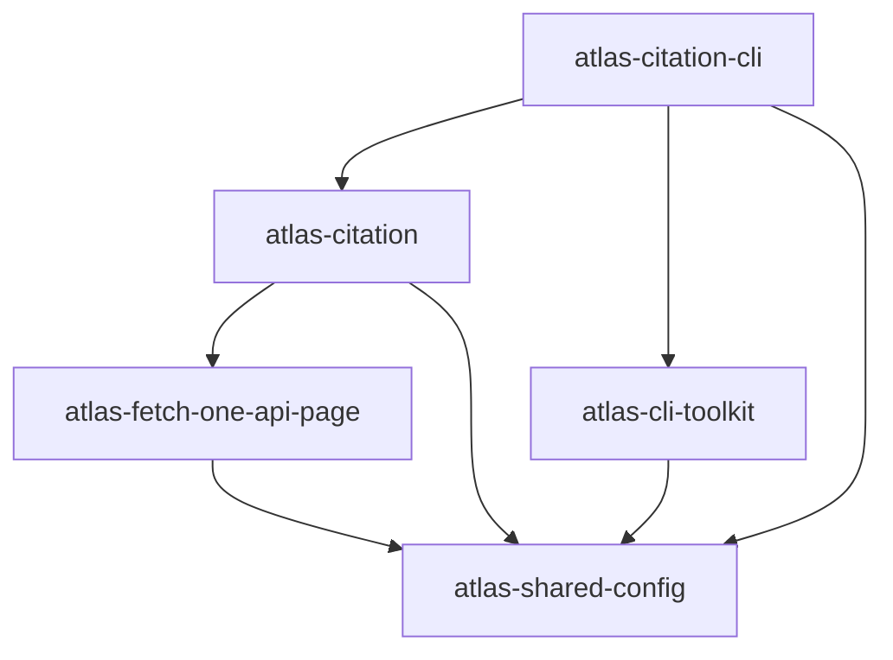

### [`atlas-crf-cli`](/atlas/packages/cli/crf)

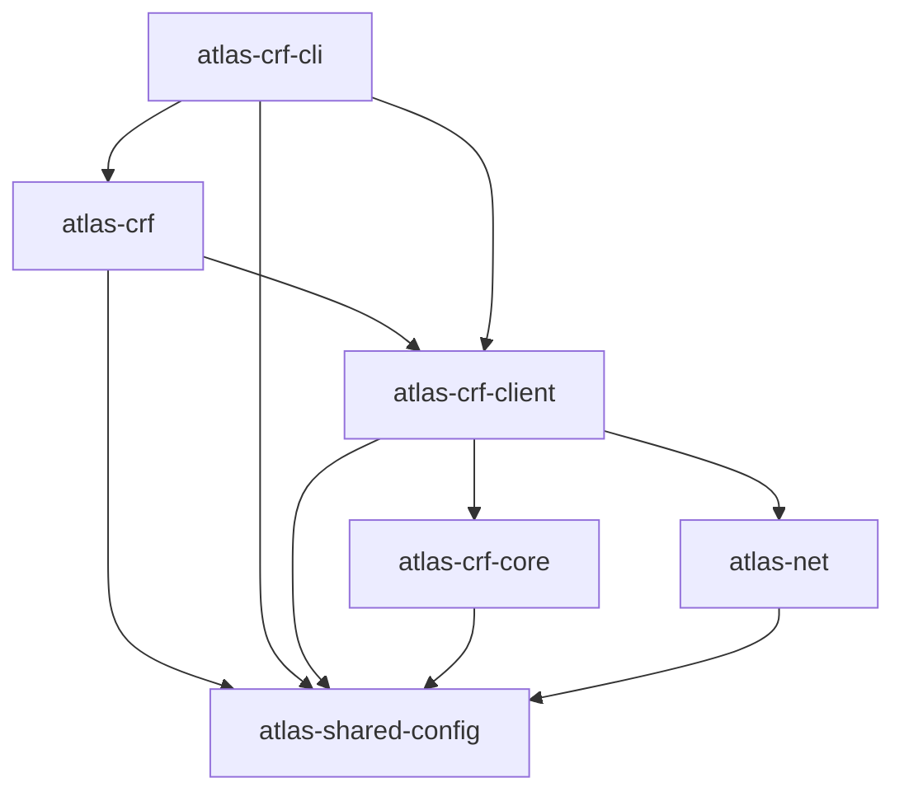

### [`atlas-crf-openapi`](/atlas/packages/cli/crf-openapi)

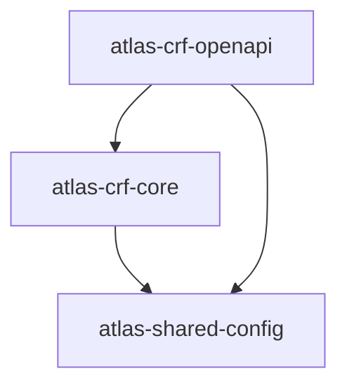

### [`atlas-crf-stats-cli`](/atlas/packages/cli/crf-stats)

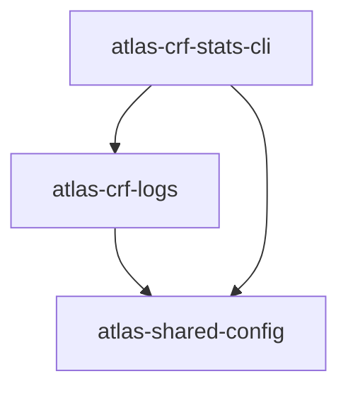

### [`atlas-net-cli`](/atlas/packages/cli/net)

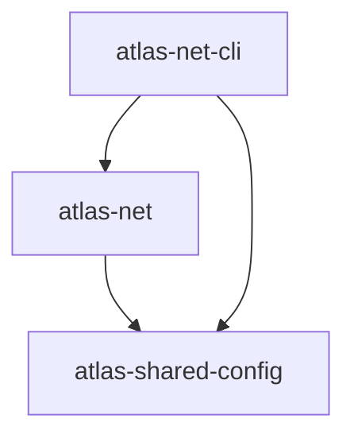

### [`atlas-researcher-profiles-cli`](/atlas/packages/cli/researcher-profiles)

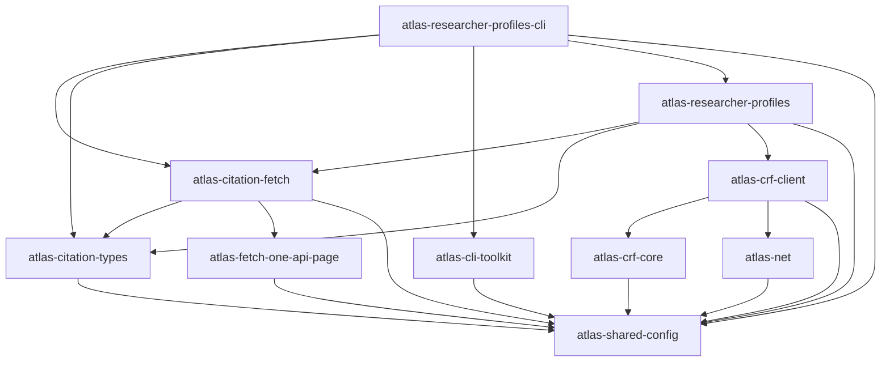

### [`atlas-stats-cli`](/atlas/packages/cli/atlas-stats)

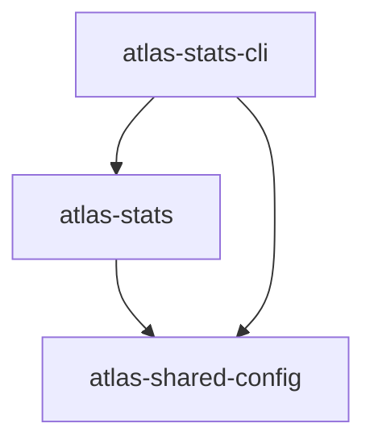

### [`atlas-crf-fixtures`](/atlas/packages/packages/crf-fixtures)

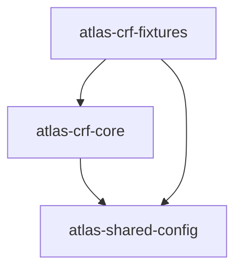

### [`atlas-crf-project-template`](/atlas/packages/packages/crf-project-template)

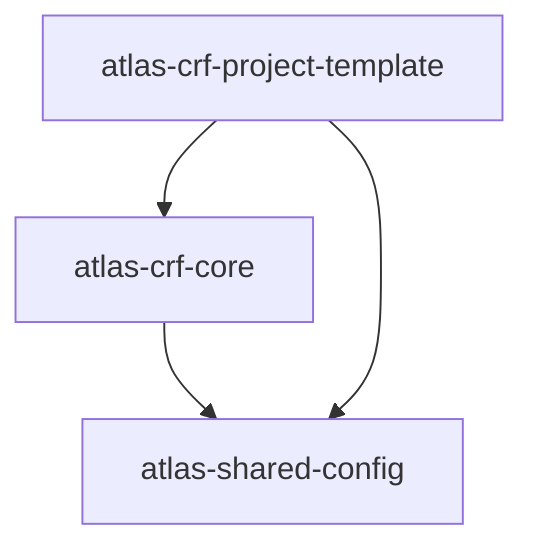

### [`atlas-amarre-sandbox`](/atlas/packages/sandbox/amarre-sandbox)

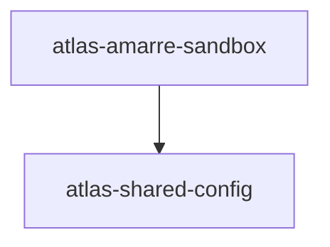

### [`atlas-crf-sandbox`](/atlas/packages/sandbox/crf-sandbox)

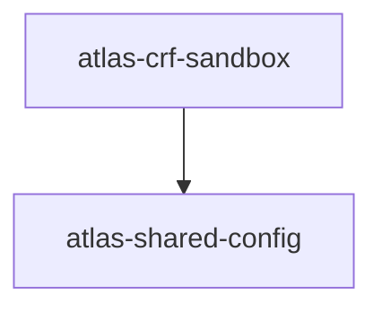

### [`atlas-sillage-sandbox`](/atlas/packages/sandbox/sillage-sandbox)

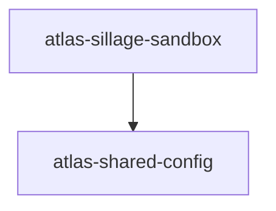

<!-- AUTO-GENERATED:packages-map END -->
