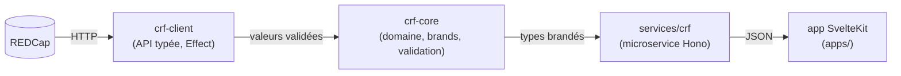

# Flux de données

Cette page décrit, à haut niveau, comment les données circulent entre les principaux composants d'Atlas. Pour le détail des outils retenus, voir [Choix techniques](./tech-choices.md).

## Vue d'ensemble

## Trois rôles, trois plateformes

| Plateforme         | Rôle dans Atlas                                                                               |
| ------------------ | --------------------------------------------------------------------------------------------- |
| **Appwrite**       | Authentification, sessions, métadonnées applicatives (consentements, paramètres utilisateurs) |
| **REDCap**         | Capture et stockage des données structurées des formulaires métier                            |
| **APIs publiques** | Enrichissement (OpenAlex pour bibliographie, GitHub pour activité de dépôts)                  |

## Cycle d'une requête type

1. L'utilisateur arrive sur une application SvelteKit (`apps/<nom>`).
2. La connexion se fait par _magic link_ : l'application demande à Appwrite d'envoyer un email avec un lien à usage unique.
3. Le clic sur le lien crée une session Appwrite côté navigateur (cookie HTTP-only).
4. À chaque action métier, l'application interroge :
   - **Appwrite** pour vérifier la session et lire/écrire les métadonnées,
   - **REDCap** pour lire/écrire les données structurées du formulaire,
   - **APIs publiques** pour enrichir l'affichage (recherche d'institutions, comptage de publications, etc.).
5. Toutes ces interactions passent par les **bibliothèques partagées** de la catégorie [`packages/`](https://github.com/univ-lehavre/atlas/tree/main/packages) (clients HTTP, validateurs, types).

## Le parcours d'une donnée à travers les paquets

La vue ci-dessus est macro (plateformes). Pour l'expert, voici le chemin **à
travers le code** d'une donnée structurée de formulaire, de la source à
l'application :

- **[`crf-client`](../../packages/crf-client/README.md)** parle à REDCap en HTTP et
  retourne des `Effect<A, E>` — l'erreur est une valeur typée, jamais une exception.
- **[`crf-core`](../../packages/crf-core/README.md)** porte le **domaine** : la
  validation et les _brands_ (voir ci-dessous).
- **[`services/crf`](../../services/crf/README.md)** expose le tout en API HTTP
  (Hono) ; c'est l'un des points où l'`Effect` est **exécuté** (`runPromise` dans le
  handler — cf. [ADR 0005](../decisions/0005-effect-pour-la-pf.md)).
- L'**application SvelteKit** consomme cette API et orchestre l'affichage.

## Les contrats : où vit la garantie

Une donnée n'est de confiance que si son type l'est. Atlas s'appuie sur deux
mécanismes, tous deux dans [`crf-core`](../../packages/crf-core/README.md) :

- **Les _brands_** (`crf-core/src/brands/`) : des identifiants **typés
  nominativement** plutôt que de simples chaînes — `CrfToken`, `RecordId`,
  `InstrumentName`, `FieldName`, `UserId`, et des primitives (`PositiveInt`,
  `NonEmptyString`, `IsoTimestamp`…). Le compilateur empêche de passer un
  `RecordId` là où un `InstrumentName` est attendu, même si les deux sont des
  chaînes à l'exécution. C'est là que vivent les invariants du domaine.
- **Effect Schema** : la trame déclarative d'un projet CRF
  ([`crf-project-template`](../../packages/crf-project-template/README.md)) décrit
  instruments, champs et métadonnées sous forme de schémas validables. Un
  dictionnaire CSV se valide contre ce schéma ; le générateur de fixtures
  ([`crf-fixtures`](../../packages/crf-fixtures/README.md)) produit des données
  cohérentes avec lui.

En pratique : une valeur brute (texte d'un champ REDCap) entre par `crf-client`,
est validée et brandée dans `crf-core`, puis circule **typée** jusqu'à
l'application. Le point de validation est unique et explicite — pas de
re-vérification dispersée.

## Pourquoi cette répartition

- **Appwrite** est généraliste mais ne sait pas porter de formulaires structurés complexes avec règles de validation métier. C'est le rôle de REDCap.
- **REDCap** est spécialisé sur les formulaires mais n'offre pas une expérience d'authentification moderne (_magic link_, sessions). D'où Appwrite en façade.
- **Les APIs publiques** (OpenAlex, GitHub) sont consommées en lecture seule, jamais stockées durablement dans Atlas — pas de doublon, pas d'obsolescence.

Le résultat : chaque plateforme fait ce qu'elle sait faire le mieux, et les applications SvelteKit jouent le rôle d'orchestrateur.
