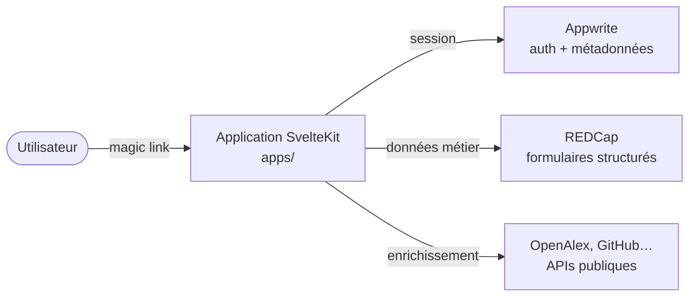

# Flux de données

Cette page décrit, à haut niveau, comment les données circulent entre les principaux composants d'Atlas. Pour le détail des outils retenus, voir [Choix techniques](./tech-choices.md).

## Vue d'ensemble

## Trois rôles, trois plateformes

| Plateforme         | Rôle dans Atlas                                                                               |
| ------------------ | --------------------------------------------------------------------------------------------- |
| **Appwrite**       | Authentification, sessions, métadonnées applicatives (consentements, paramètres utilisateurs) |
| **REDCap**         | Capture et stockage des données structurées des formulaires métier                            |
| **APIs publiques** | Enrichissement (OpenAlex pour bibliographie, GitHub pour activité de dépôts)                  |

## Cycle d'une requête type

1. L'utilisateur arrive sur une application SvelteKit (`apps/<nom>`).
2. La connexion se fait par _magic link_ : l'application demande à Appwrite d'envoyer un email avec un lien à usage unique.
3. Le clic sur le lien crée une session Appwrite côté navigateur (cookie HTTP-only).
4. À chaque action métier, l'application interroge :
   - **Appwrite** pour vérifier la session et lire/écrire les métadonnées,
   - **REDCap** pour lire/écrire les données structurées du formulaire,
   - **APIs publiques** pour enrichir l'affichage (recherche d'institutions, comptage de publications, etc.).
5. Toutes ces interactions passent par les **bibliothèques partagées** de la catégorie [`packages/`](https://github.com/univ-lehavre/atlas/tree/main/packages) (clients HTTP, validateurs, types).

## Pourquoi cette répartition

- **Appwrite** est généraliste mais ne sait pas porter de formulaires structurés complexes avec règles de validation métier. C'est le rôle de REDCap.
- **REDCap** est spécialisé sur les formulaires mais n'offre pas une expérience d'authentification moderne (_magic link_, sessions). D'où Appwrite en façade.
- **Les APIs publiques** (OpenAlex, GitHub) sont consommées en lecture seule, jamais stockées durablement dans Atlas — pas de doublon, pas d'obsolescence.

Le résultat : chaque plateforme fait ce qu'elle sait faire le mieux, et les applications SvelteKit jouent le rôle d'orchestrateur.
