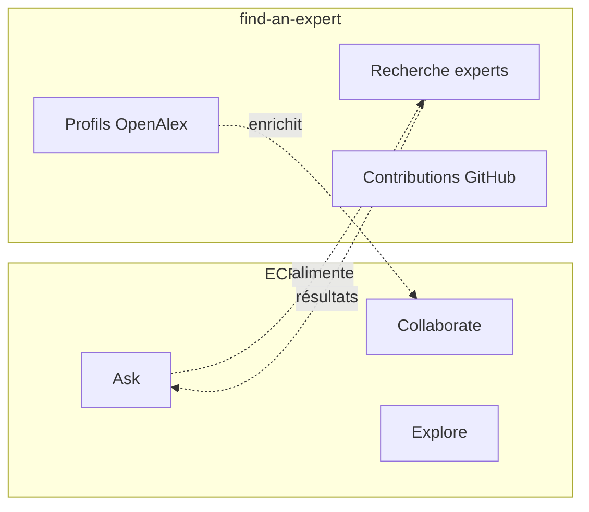

# Audit de l'application ECRIN

> **Dernière mise à jour :** 28 janvier 2026

Ce document présente un audit complet de l'application ECRIN, analysant son architecture, ses 6 cartes fonctionnelles et leur potentiel d'évolution en applications autonomes.

## Résumé exécutif

ECRIN est une plateforme de collaboration pour chercheurs développée par l'Université Le Havre Normandie dans le cadre des projets Campus Polytechnique des Territoires Maritimes et Portuaires et EUNICoast.

| Métrique | Valeur |
|----------|--------|
| Cartes fonctionnelles | 6 |
| Cartes implémentées | 3 (50%) |
| Applications candidates à extraction | 3 |
| Technologies principales | SvelteKit 2, Svelte 5, Sigma.js, Appwrite |

---

## 1. Architecture générale

### 1.1 Vue d'ensemble

ECRIN est organisée autour de **6 cartes fonctionnelles**, chacune représentant un domaine métier distinct pouvant potentiellement évoluer en application autonome.

```
packages/ecrin/
├── src/
│   ├── routes/                    # Routes SvelteKit
│   │   ├── +page.svelte          # Page principale (6 cartes)
│   │   ├── api/v1/               # Points d'API REST
│   │   ├── global/               # Visualisation graphe
│   │   └── login/                # Authentification
│   └── lib/
│       ├── ui/                   # Composants des 6 cartes
│       ├── server/services/      # Logique métier
│       ├── appwrite/             # Intégration Appwrite
│       ├── redcap/               # Intégration REDCap
│       └── graph/                # Génération de graphes
```

### 1.2 Intégrations techniques

| Système | Rôle | Usage |
|---------|------|-------|
| **REDCap** | Source de données | Enquêtes, enregistrements utilisateurs, projets |
| **Appwrite** | Backend | Authentification, sessions, base de données |
| **Sigma.js + Graphology** | Visualisation | Graphes de réseaux de recherche |

---

## 2. Les 6 cartes fonctionnelles

### Vue d'ensemble

| Carte | Composant | Description | Statut backend |
|-------|-----------|-------------|:--------------:|
| **Introduce** | `Introduce.svelte` | Présenter ses travaux de recherche | ❌ Interface seulement |
| **Collaborate** | `Collaborate.svelte` | Trouver des collaborateurs et créer des projets | ✅ Fonctionnel |
| **Explore** | `Explore.svelte` | Visualiser les réseaux de recherche | ✅ Fonctionnel |
| **Ask** | `Ask.svelte` | Rechercher des données et des experts | ❌ Interface seulement |
| **Publish** | `Publish.svelte` | Partager ses données et actualités | ❌ Interface seulement |
| **Administrate** | `Administrate.svelte` | Gérer son compte et ses enquêtes | ✅ Fonctionnel |

---

## 3. Détail des cartes

### 3.1 Carte "Introduce" (Présenter)

**Fichier :** `packages/ecrin/src/lib/ui/Introduce.svelte`

**Objectif :** Permettre aux chercheurs de présenter leurs travaux de recherche pour obtenir des retours de la communauté.

#### Sous-cartes

| Sous-carte | Description | Implémentation |
|------------|-------------|:--------------:|
| Ma question scientifique | Décrire sa recherche pour obtenir des retours | ❌ Interface seulement |
| Mes références | Référencer ses publications récentes | ❌ Interface seulement |

#### État d'implémentation

- **Frontend :** Structure de l'interface présente
- **Backend :** Aucune intégration

#### Recommandation

Intégrer avec **find-an-expert** pour :
- Récupérer automatiquement les publications via OpenAlex
- Construire le profil chercheur à partir des données bibliographiques

---

### 3.2 Carte "Collaborate" (Collaborer)

**Fichier :** `packages/ecrin/src/lib/ui/Collaborate.svelte`

**Objectif :** Faciliter la création de projets collaboratifs et la constitution d'équipes de recherche.

#### Sous-cartes

| Sous-carte | Description | Implémentation |
|------------|-------------|:--------------:|
| Créer mon projet | Déclarer un projet pour trouver des collaborateurs | ✅ Lien enquête REDCap |
| Constituer mon équipe | Rechercher des collaborateurs avec compétences spécifiques | ⚠️ Partiel |
| Trouver un expert | Se connecter avec des experts | ❌ Renvoie vers find-an-expert |
| Financer mon projet | Rechercher des opportunités de financement | ❌ Interface seulement |

#### Services utilisés

```typescript
// Services backend
surveysService.getSurveyUrl()      // Génère lien vers enquête REDCap
accountService.pushAccountToRedcap() // Synchronise compte avec REDCap
authService.signupWithEmail()       // Inscription par email
```

#### Points d'API

| Méthode | Endpoint | Description |
|---------|----------|-------------|
| GET | `/api/v1/surveys/url` | Obtenir l'URL de l'enquête REDCap |
| GET | `/api/v1/account/push` | Synchroniser le compte avec REDCap |

#### Potentiel d'extraction

**Élevé** - Cette carte pourrait devenir un package `@univ-lehavre/ecrin-collaborator` avec :
- Gestion des projets de recherche
- Recherche de collaborateurs
- Intégration enquêtes REDCap

---

### 3.3 Carte "Explore" (Explorer)

**Fichier :** `packages/ecrin/src/lib/ui/Explore.svelte`

**Objectif :** Visualiser les réseaux de recherche à travers des graphes interactifs.

#### Sous-cartes

| Sous-carte | Description | Implémentation |
|------------|-------------|:--------------:|
| Mon graphe | Visualiser son réseau personnel | ✅ Fonctionnel |
| Graphe communautaire | Voir les connexions de la communauté | ✅ Fonctionnel |

#### Technologies

| Bibliothèque | Version | Usage |
|--------------|---------|-------|
| Sigma.js | Dernière | Rendu des graphes |
| Graphology | Dernière | Structure de données graphe |
| ForceAtlas2 | Intégré | Algorithme de positionnement |

#### Points d'API

| Méthode | Endpoint | Description |
|---------|----------|-------------|
| GET | `/api/v1/graphs?record={id}` | Graphe personnel d'un utilisateur |
| GET | `/api/v1/graphs/global` | Graphe de la communauté |

#### Types de nœuds

| Type | Couleur | Description |
|------|---------|-------------|
| Chercheur | Jaune | Utilisateurs de la plateforme |
| Projet | Vert | Projets de recherche |
| Thématique | Bleu | Domaines de recherche |
| Mot-clé | Violet | Mots-clés associés |
| Méthode | Magenta | Méthodes de recherche |
| Zone géographique | Cyan | Localisation géographique |

#### Potentiel d'extraction

**Très élevé** - Cette carte est un excellent candidat pour un package `@univ-lehavre/ecrin-graph-explorer` car :
- Composant autonome et réutilisable
- Logique de génération de graphe indépendante
- Peut fonctionner avec différentes sources de données

---

### 3.4 Carte "Ask" (Demander)

**Fichier :** `packages/ecrin/src/lib/ui/Ask.svelte`

**Objectif :** Permettre aux chercheurs de trouver des données et des experts.

#### Sous-cartes

| Sous-carte | Description | Implémentation |
|------------|-------------|:--------------:|
| Données | Rechercher des données pour sa recherche | ❌ Interface seulement |
| Un expert par localisation | Trouver un expert dans une zone géographique | ❌ Interface seulement |
| Un expert par thématique | Trouver un expert sur un sujet | ❌ Interface seulement |
| Un expert possédant des données | Trouver un expert ayant des données pertinentes | ❌ Interface seulement |

#### État d'implémentation

- **Frontend :** Interface désactivée (boutons inactifs)
- **Backend :** Non implémenté

#### Recommandation

**Fusionner avec find-an-expert** :
- find-an-expert fournit déjà la recherche d'experts via OpenAlex et GitHub
- Évite la duplication de fonctionnalités
- Capitalise sur les données bibliographiques existantes

---

### 3.5 Carte "Publish" (Publier)

**Fichier :** `packages/ecrin/src/lib/ui/Publish.svelte`

**Objectif :** Permettre aux chercheurs de partager leurs productions avec la communauté.

#### Sous-cartes

| Sous-carte | Description | Implémentation |
|------------|-------------|:--------------:|
| Mes données | Publier des jeux de données | ❌ Interface seulement |
| Mes actualités | Écrire des articles de blog | ❌ Interface seulement |

#### État d'implémentation

- **Frontend :** Structure de l'interface présente
- **Backend :** Non implémenté

#### Prérequis pour implémentation

1. **Système de stockage de fichiers** pour les jeux de données
2. **Système de gestion de contenu** pour les articles
3. **Politique de modération** pour les publications

#### Potentiel d'extraction

**Moyen** - Nécessite une infrastructure significative avant d'être un package autonome.

---

### 3.6 Carte "Administrate" (Administrer)

**Fichier :** `packages/ecrin/src/lib/ui/Administrate.svelte`

**Objectif :** Permettre aux utilisateurs de gérer leur compte et leurs données.

#### Sous-cartes

| Sous-carte | Description | Implémentation |
|------------|-------------|:--------------:|
| Mon compte - S'inscrire | Créer un compte | ✅ Fonctionnel |
| Mon compte - Se déconnecter | Terminer la session | ✅ Fonctionnel |
| Mon compte - Supprimer | Supprimer son compte | ✅ Fonctionnel |
| Mon enquête - S'abonner | Accepter la politique de données | ✅ Fonctionnel |
| Mon enquête - Télécharger | Exporter ses données (CSV/JSON) | ✅ Fonctionnel |
| Mon enquête - Supprimer | Supprimer ses données REDCap | ✅ Fonctionnel |

#### Services utilisés

```typescript
// Services d'authentification
authService.signupWithEmail()    // Inscription par URL magique
authService.login()              // Création de session
authService.logout()             // Destruction de session
authService.deleteUser()         // Suppression de compte

// Services d'enquête
surveysService.getSurveyUrl()    // Lien vers enquête
surveysService.downloadSurvey()  // Export des données
surveysService.deleteSurveyRecord() // Suppression REDCap

// Services de compte
accountService.checkAccountPushed() // Vérification statut
```

#### Points d'API

| Méthode | Endpoint | Description |
|---------|----------|-------------|
| POST | `/api/v1/auth/signup` | Inscription par email |
| POST | `/api/v1/auth/login` | Connexion |
| POST | `/api/v1/auth/logout` | Déconnexion |
| DELETE | `/api/v1/auth/delete` | Suppression compte |
| GET | `/api/v1/surveys/download` | Téléchargement données |
| DELETE | `/api/v1/surveys/delete` | Suppression enquête |

#### Potentiel d'extraction

**Élevé** - La logique d'authentification est déjà partiellement extraite dans `@univ-lehavre/atlas-auth`. Cette carte pourrait être généralisée en :
- `@univ-lehavre/ecrin-account-manager` pour la gestion de compte
- Intégration avec le package `auth` existant

---

## 4. Relation avec find-an-expert

### 4.1 Comparaison fonctionnelle

| Aspect | ECRIN | find-an-expert |
|--------|-------|----------------|
| **Objectif principal** | Collaboration et projets | Découverte d'expertise |
| **Sources de données** | REDCap (enquêtes déclaratives) | OpenAlex, GitHub (données publiques) |
| **Recherche d'experts** | Carte "Ask" (non implémentée) | Fonctionnalité principale |
| **Profil chercheur** | Basé sur enquêtes | Basé sur publications |
| **Statut** | Application principale | Sous-projet spécialisé |

### 4.2 Complémentarité



### 4.3 Recommandation d'intégration

Positionner **find-an-expert comme le moteur de découverte d'expertise d'ECRIN** :

1. La carte "Ask" d'ECRIN redirige vers find-an-expert
2. find-an-expert fournit les résultats de recherche
3. Les profils find-an-expert enrichissent les données ECRIN

---

## 5. Synthèse des recommandations

### 5.1 Court terme

| Action | Priorité | Effort |
|--------|:--------:|:------:|
| Intégrer find-an-expert avec la carte "Ask" | 🔴 Haute | Moyen |
| Documenter les 6 cartes dans le README ECRIN | 🔴 Haute | Faible |
| Extraire le composant Graph en package réutilisable | 🟡 Moyenne | Moyen |

### 5.2 Moyen terme

| Action | Priorité | Effort |
|--------|:--------:|:------:|
| Implémenter la carte "Introduce" avec OpenAlex | 🟡 Moyenne | Élevé |
| Extraire la logique Collaborate en package | 🟢 Basse | Moyen |
| Définir l'architecture pour la carte "Publish" | 🟢 Basse | Élevé |

### 5.3 Packages candidats à extraction

| Package proposé | Source | Dépendances |
|-----------------|--------|-------------|
| `@univ-lehavre/ecrin-graph-explorer` | Carte Explore | graphology, sigma |
| `@univ-lehavre/ecrin-collaborator` | Carte Collaborate | REDCap, Appwrite |
| `@univ-lehavre/ecrin-account-manager` | Carte Administrate | Appwrite, atlas-auth |

---

## 6. Annexe : Structure des fichiers analysés

```
packages/ecrin/src/lib/ui/
├── Introduce.svelte       # Carte Présenter
├── Collaborate.svelte     # Carte Collaborer
├── Explore.svelte         # Carte Explorer
├── Ask.svelte             # Carte Demander
├── Publish.svelte         # Carte Publier
├── Administrate.svelte    # Carte Administrer
├── Options.svelte         # Options administrateur
├── Graph.svelte           # Composant de visualisation
├── GraphSelector.svelte   # Sélecteur vue graphe
├── CardItem.svelte        # Composant carte générique
├── HorizontalScroller.svelte # Défilement horizontal
└── TopNavbar.svelte       # Barre de navigation
```
