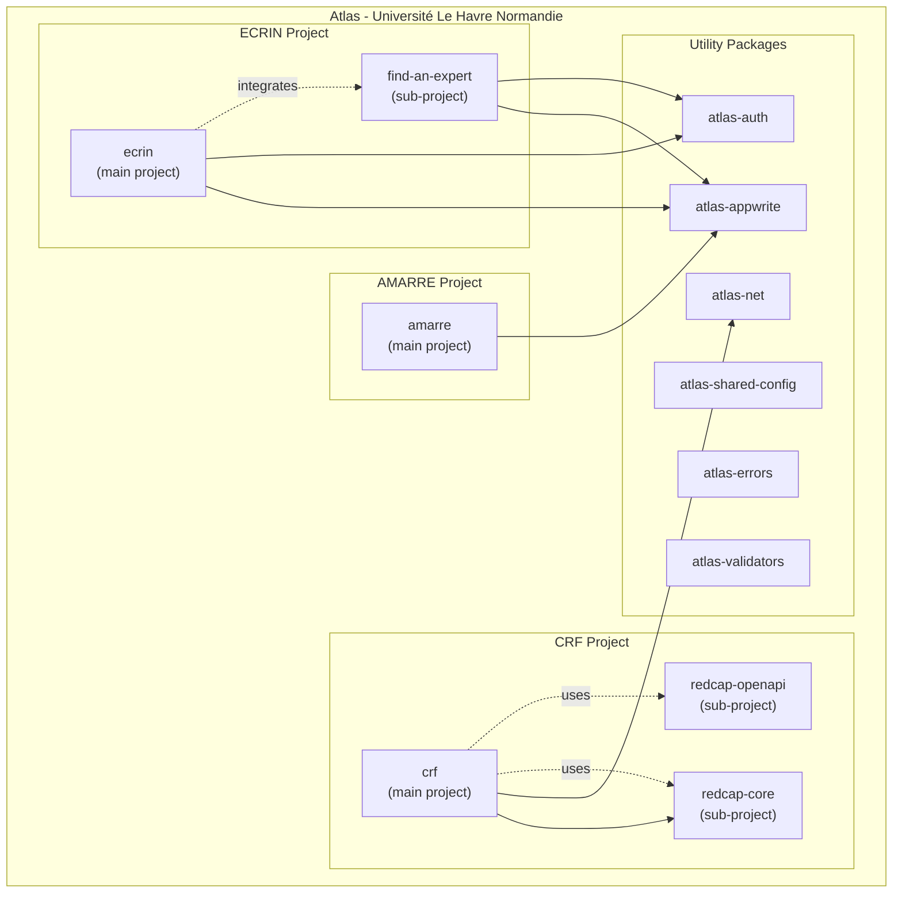

# Architecture

## Package Architecture



## Functional Programming with Effect

This project adopts a **functional programming** approach with [Effect](https://effect.website/), a TypeScript library for building robust and type-safe applications.

### Why Effect?

- **Type-safe error handling**: Errors are treated as values, not exceptions
- **Composability**: Modular and reusable code via `pipe` and combinators
- **Built-in observability**: Tracing and metrics compatible with OpenTelemetry
- **Resource management**: Automatic acquisition and release (like `try-with-resources`)
- **Structured concurrency**: Clean interruption and fiber management

## ESLint Configuration

The project uses a strict ESLint configuration combining multiple plugins. See [@univ-lehavre/atlas-eslint-config](https://github.com/univ-lehavre/atlas/tree/main/packages/eslint-config) for details.

### TypeScript Strict

Based on `tseslint.configs.strictTypeChecked` with additional rules:

| Rule                          | Description                                      |
| ----------------------------- | ------------------------------------------------ |
| `strict-boolean-expressions`  | Forbids implicit boolean coercions               |
| `no-floating-promises`        | Requires handling all promises                   |
| `no-unnecessary-condition`    | Detects always true/false conditions             |
| `consistent-type-imports`     | Forces `import type` for type imports            |
| `switch-exhaustiveness-check` | Verifies all cases are covered                   |
| `no-explicit-any`             | Forbids `any` (error, not warn)                  |

### Functional Programming

Based on [eslint-plugin-functional](https://github.com/eslint-functional/eslint-plugin-functional):

| Rule                        | Status | Description                                          |
| --------------------------- | ------ | ---------------------------------------------------- |
| `no-expression-statements`  | error  | Forbids expressions without return                   |
| `no-conditional-statements` | error  | Forbids if/switch (forces ternaries/matching)        |
| `no-throw-statements`       | error  | Forbids throw (forces Effect)                        |
| `no-try-statements`         | error  | Forbids try/catch (forces Effect)                    |
| `immutable-data`            | error  | Forbids mutation of objects/arrays                   |
| `no-classes`                | off    | Disabled (Effect uses classes)                       |

### Security

Based on [eslint-plugin-security](https://github.com/eslint-community/eslint-plugin-security):

| Rule                          | Description                              |
| ----------------------------- | ---------------------------------------- |
| `detect-unsafe-regex`         | Detects regex vulnerable to ReDoS        |
| `detect-eval-with-expression` | Forbids eval() with expressions          |
| `detect-object-injection`     | Warns on dynamic access                  |

### Code Quality

| Rule                     | Value | Description                              |
| ------------------------ | ----- | ---------------------------------------- |
| `max-depth`              | 4     | Max nesting depth                        |
| `max-lines-per-function` | 60    | Max lines per function                   |
| `complexity`             | 15    | Max cyclomatic complexity                |
| `no-console`             | error | Forbids console.log (allow: warn, error) |

### Ignored Effect Patterns

Certain patterns are explicitly allowed for Effect and Hono:

```javascript
// Effect patterns
Effect.runPromise(...)
pipe(value, Effect.map(...))
Layer.succeed(...)

// Hono patterns (route configuration)
app.get('/path', handler)
records.post('/', handler)
```

### Test Files

Strict rules are disabled for `*.test.ts` and `*.spec.ts` files to allow classic test patterns.

## Scripts

### `ready` Script

The `pnpm ready` script runs all checks before a release. The order is optimized according to the **fail-fast** principle: the fastest and most likely to fail checks are run first.

```bash
pnpm check && pnpm typecheck && pnpm test && pnpm audit:all && pnpm build
```

**Execution order:**

1. **`check`** (format, lint, knip, cpd in parallel) - Very fast, often fails on style errors or unused imports
2. **`typecheck`** - Fast, detects typing errors
3. **`test`** - Variable duration, but essential before the following steps
4. **`audit:all`** (audit + license:audit in parallel) - Security and license checks
5. **`build`** - The longest, run last because if previous steps fail, no need to build

### License Audit

The `license:audit` script verifies that all dependencies use allowed licenses:

```bash
pnpm license:audit
```

**Allowed licenses:**

| License          | Description                                                        |
| ---------------- | ------------------------------------------------------------------ |
| **MIT**          | Very permissive license, most common in the npm ecosystem          |
| **Apache-2.0**   | Permissive with patent protection                                  |
| **BSD-2-Clause** | Permissive, simplified version (2 clauses)                         |
| **BSD-3-Clause** | Permissive, original version (3 clauses)                           |
| **ISC**          | Equivalent to MIT, simplified                                      |
| **0BSD**         | Public domain, no restrictions                                     |
| **Unlicense**    | Explicit public domain                                             |

**Why these licenses?**

All these licenses are **permissive** and allow:

- Commercial use
- Code modification
- Distribution
- Private use

They **do not** require sharing source code (unlike copyleft licenses like GPL), which is important for a project that may be used in various contexts.

## MCP Servers

The project is configured to use [Model Context Protocol (MCP)](https://modelcontextprotocol.io/) servers that provide documentation and tools to AI assistants.

### Configuration

MCP servers are configured in `.mcp.json`:

```json
{
  "mcpServers": {
    "effect-mcp": {
      "command": "pnpm",
      "args": ["dlx", "@niklaserik/effect-mcp"]
    },
    "svelte-mcp": {
      "command": "pnpm",
      "args": ["dlx", "@sveltejs/mcp"]
    },
    "appwrite-docs": {
      "command": "npx",
      "args": ["mcp-remote", "https://mcp-for-docs.appwrite.io"]
    },
    "appwrite-api": {
      "command": "uvx",
      "args": ["mcp-server-appwrite", "--all"],
      "env": {
        "APPWRITE_PROJECT_ID": "${APPWRITE_PROJECT_ID}",
        "APPWRITE_API_KEY": "${APPWRITE_API_KEY}",
        "APPWRITE_ENDPOINT": "${APPWRITE_ENDPOINT}"
      }
    },
    "openalex": {
      "command": "npx",
      "args": ["openalex-mcp"]
    }
  }
}
```

### Available Servers

| Server          | Description                                               |
| --------------- | --------------------------------------------------------- |
| `effect-mcp`    | Effect.js documentation                                   |
| `svelte-mcp`    | Svelte 5 and SvelteKit documentation                      |
| `appwrite-docs` | Appwrite documentation                                    |
| `appwrite-api`  | Appwrite API (requires env vars)                          |
| `openalex`      | OpenAlex API for academic research (240M+ articles)       |

### Prerequisites

- **Node.js/npm**: For `effect-mcp`, `svelte-mcp`, `appwrite-docs`, `openalex`
- **uv (Python)**: For `appwrite-api` (`curl -LsSf https://astral.sh/uv/install.sh | sh`)

### Environment Variables for Appwrite

To use the `appwrite-api` server, configure:

```bash
export APPWRITE_PROJECT_ID="your_project_id"
export APPWRITE_API_KEY="your_api_key"
export APPWRITE_ENDPOINT="https://appwrite.yourdomain.com/v1"
```

## Third-party Platforms

Atlas relies on two third-party platforms for its features:

### REDCap (Research Electronic Data Capture)

[REDCap](https://project-redcap.org/) is a secure web application developed by Vanderbilt University for creating and managing online surveys and research databases.

| Feature | Value |
|---------|-------|
| Partner institutions | 8,000+ |
| Countries | 164 |
| Scientific citations | 51,000+ |
| Compliance | GDPR, HIPAA, 21 CFR Part 11 |
| Cost | Free for Consortium members |

REDCap enables web and mobile data collection (including offline). The CRF module provides TypeScript tools for interacting with the REDCap API.

### Appwrite

[Appwrite](https://appwrite.io/) is an open-source backend platform providing essential services for application development:

| Service | Description |
|---------|-------------|
| Authentication | Login via email, OAuth, magic links |
| Database | Data storage and querying |
| Storage | File management with encryption |
| Functions | Serverless code execution |

Appwrite is compliant with SOC-2, GDPR and HIPAA standards. The ECRIN and AMARRE projects use Appwrite for authentication and user data management.
