# Atlas

Atlas est une plateforme développée par l'**Université Le Havre Normandie** pour faciliter la recherche et la collaboration entre chercheurs.

## Les quatre modules majeurs

Atlas est composé de **quatre modules majeurs** :

| Module | Description | Sous-projets |
|--------|-------------|--------------|
| **ECRIN** | Plateforme de collaboration pour chercheurs | find-an-expert |
| **AMARRE** | Gestion de la mobilité des chercheurs | - |
| **Citations** | Agrégation de sources bibliographiques et fiabilisation des profils | openalex, crossref, hal, arxiv, orcid, verify |
| **CRF** | Outils pour interagir avec REDCap | redcap-core, redcap-openapi |

### Module ECRIN

**Pour qui ?** Chercheurs de tous domaines souhaitant collaborer et présenter leurs travaux.

ECRIN est une plateforme de collaboration pour chercheurs permettant de présenter ses travaux, trouver des collaborateurs et visualiser les réseaux de recherche.

**Ce que ça permet :**

- Présenter ses travaux de recherche
- Trouver des collaborateurs et constituer des équipes
- Visualiser les réseaux de recherche
- Rechercher des experts et des données

**Sous-projets :**

| Sous-projet | État |
|-------------|------|
| introduce-my-scientific-questions | 🚧 En cours |
| introduce-my-references | 🚧 En cours |
| collaborate-create-my-project | 🚧 En cours |
| collaborate-build-my-team | 📋 Prévu |
| collaborate-find-my-expert | 📋 Prévu |
| collaborate-fund-my-project | 📋 Prévu |
| explore-my-graph | 📋 Prévu |
| explore-community-graph | 📋 Prévu |
| ask-data | 📋 Prévu |
| ask-an-expert | 🚧 En cours |
| publish-my-data | 📋 Prévu |
| publish-my-news | 📋 Prévu |

### Module AMARRE

**Pour qui ?** Chercheurs souhaitant gérer leur mobilité internationale.

AMARRE est une application de gestion de la mobilité des chercheurs.

**Ce que ça permet :**

- Gérer la mobilité internationale des chercheurs

### Module Citations

**Pour qui ?** Chercheurs souhaitant fiabiliser leur profil bibliographique et développeurs intégrant des sources bibliographiques.

Atlas Citations est une suite de packages pour interroger des sources bibliographiques (OpenAlex, Crossref, HAL, ArXiv, ORCID) via des clients Effect typés. Atlas Verify permet aux chercheurs de fiabiliser leur profil bibliographique.

**Ce que ça permet :**

- Interroger plusieurs sources bibliographiques via une API unifiée
- Fiabiliser les profils chercheurs (vérifier les publications, corriger les attributions)
- Reconstruire le parcours et le réseau de collaboration d'un chercheur

**Sous-projets :**

| Sous-projet | État |
|-------------|------|
| openalex | 🚧 En cours |
| crossref | 🚧 En cours |
| hal | 📋 Prévu |
| arxiv | 📋 Prévu |
| orcid | 📋 Prévu |
| verify | 🚧 En cours |

### Module CRF (Case Report Form)

**Pour qui ?** Équipes de recherche, investigateurs, data managers.

CRF fournit des outils TypeScript pour interagir avec l'API REDCap de manière sécurisée et typée.

**Ce que ça permet :**

- Accéder aux données de vos études REDCap de manière sécurisée
- Exporter et analyser vos données programmatiquement
- Automatiser des tâches répétitives via l'API REDCap
- Diagnostiquer les problèmes de connectivité réseau

**Sous-projets :**
- **redcap-core** : logique métier REDCap pure avec Effect
- **redcap-openapi** : extraction et analyse de spécifications OpenAPI depuis le code source REDCap

## Architecture des packages

```mermaid
graph TB
    subgraph "Atlas - Université Le Havre Normandie"
        subgraph "Module ECRIN"
            ECRIN_APP["ecrin<br/>(module principal)"]
            FAE["find-an-expert<br/>(sous-projet)"]
        end

        subgraph "Module AMARRE"
            AMARRE["amarre<br/>(module principal)"]
        end

        subgraph "Module CRF"
            CRF["crf<br/>(module principal)"]
            CORE["redcap-core<br/>(sous-projet)"]
            OPENAPI["redcap-openapi<br/>(sous-projet)"]
        end

        subgraph "Sous-modules utilitaires"
            NET["atlas-net"]
            CONFIG["atlas-shared-config"]
            APPWRITE["atlas-appwrite"]
            AUTH["atlas-auth"]
            ERRORS["atlas-errors"]
            VALIDATORS["atlas-validators"]
        end
    end

    FAE --> APPWRITE
    FAE --> AUTH
    ECRIN_APP --> APPWRITE
    ECRIN_APP --> AUTH
    AMARRE --> APPWRITE
    CRF --> CORE
    CRF --> NET
    ECRIN_APP -.->|"intègre"| FAE
    CRF -.->|"utilise"| CORE
    CRF -.->|"utilise"| OPENAPI
```

## Documentation

Consultez la barre de navigation pour accéder aux différentes sections :

- **[ECRIN](/guide/audit/ecrin-audit)** - Plateforme de collaboration pour chercheurs
- **[AMARRE](/guide/amarre/)** - Gestion de la mobilité des chercheurs
- **[Citations](/guide/citations/)** - Agrégation de sources bibliographiques
- **[CRF](/guide/dev/crf)** - Outils pour interagir avec REDCap
- **[Audits](/guide/audit/)** - Audits techniques et documentation
- **[API](/api/)** - Référence des packages

## Plateformes tierces

Atlas s'appuie sur deux plateformes tierces pour ses fonctionnalités :

### REDCap (Research Electronic Data Capture)

[REDCap](https://project-redcap.org/) est une application web sécurisée développée par l'Université Vanderbilt pour la création et la gestion d'enquêtes en ligne et de bases de données de recherche.

| Caractéristique | Valeur |
|-----------------|--------|
| Institutions partenaires | 8 000+ |
| Pays | 164 |
| Citations scientifiques | 51 000+ |
| Conformité | RGPD, HIPAA, 21 CFR Part 11 |
| Coût | Gratuit pour les membres du Consortium |

REDCap permet la collecte de données sur le web et sur mobile (y compris hors connexion). Le module CRF fournit des outils TypeScript pour interagir avec l'API REDCap.

### Appwrite

[Appwrite](https://appwrite.io/) est une plateforme backend open source fournissant les services essentiels pour le développement d'applications :

| Service | Description |
|---------|-------------|
| Authentification | Connexion par email, OAuth, liens magiques |
| Base de données | Stockage et requêtage de données |
| Stockage | Gestion de fichiers avec chiffrement |
| Fonctions | Exécution de code serverless |

Appwrite est conforme aux normes SOC-2, RGPD et HIPAA. Les modules ECRIN et AMARRE utilisent Appwrite pour l'authentification et la gestion des données utilisateurs.

## Projets institutionnels

Atlas est développé dans le cadre de deux projets portés par l'Université Le Havre Normandie :

### Campus Polytechnique des Territoires Maritimes et Portuaires

Programme de recherche et de formation centré sur les enjeux maritimes et portuaires du territoire havrais et normand.

### EUNICoast

[EUNICoast](https://eunicoast.eu/) est une alliance universitaire européenne regroupant des établissements d'enseignement supérieur situés sur les zones côtières européennes.

## Objectifs du projet

Atlas est développé avec plusieurs objectifs :

1. **Simplifier l'accès aux données** - Les chercheurs ne devraient pas avoir besoin de connaissances techniques avancées pour accéder à leurs données
2. **Fiabiliser les profils** - Les bases bibliographiques contiennent des erreurs (homonymes, mauvaises attributions) que seuls les chercheurs peuvent corriger
3. **Sécuriser les échanges** - Les données de recherche sont sensibles et nécessitent une infrastructure sécurisée
4. **Faciliter l'interopérabilité** - Atlas connecte des systèmes qui ne communiquent pas nativement ensemble
5. **Favoriser la collaboration** - ECRIN permet aux chercheurs de se trouver et de travailler ensemble

## Qui développe Atlas ?

Atlas est développé par l'équipe du cabinet de la présidence de l'Université Le Havre Normandie et de la vice-présidente à la recherche.

Le projet est open source et disponible sur [GitHub](https://github.com/univ-lehavre/atlas).
