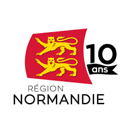

## À propos d'Atlas

Atlas est un ensemble d'outils développés par l'**Université Le Havre Normandie** pour faciliter le travail des chercheurs et des équipes de recherche.

### Pour les chercheurs

- **Vérifiez vos publications** : identifiez et corrigez les attributions erronées dans OpenAlex, Crossref et HAL grâce à Atlas Verify
- **Gérez votre parcours** : maintenez un historique fiable de vos affiliations, suivez vos changements d'institution et vos périodes de mobilité
- **Découvrez des experts** : recherchez des collaborateurs par thématique, localisation ou compétences spécifiques via ECRIN
- **Visualisez vos réseaux** : explorez vos co-auteurs, projets communs et connexions interdisciplinaires avec des graphes interactifs
- **Déclarez vos projets** : créez des fiches projet pour recruter des collaborateurs et obtenir des financements
- **Publiez vos données** : partagez vos jeux de données et actualités avec la communauté scientifique

### Pour les développeurs

- **Client REDCap** : bibliothèque TypeScript avec Effect pour interroger l'API REDCap de manière typée et sécurisée
- **Extraction OpenAPI** : génération automatique de spécifications OpenAPI depuis le code source PHP de REDCap
- **Clients bibliographiques** : packages Effect pour OpenAlex, Crossref, HAL, ArXiv et ORCID avec rate limiting intégré
- **Outils CLI** : diagnostics réseau, tests de connectivité et validation de configurations
- **Configuration partagée** : ESLint, TypeScript et Prettier standardisés pour tout le monorepo
- **Intégration Appwrite** : authentification, gestion des sessions et stockage de données utilisateurs

## Projets institutionnels

Atlas est développé dans le cadre de projets structurants portés par l'Université Le Havre Normandie.

### Campus Polytechnique des Territoires Maritimes et Portuaires

Le [Campus Polytechnique des Territoires Maritimes et Portuaires](https://www.cptmp.fr/) (CPTMP) est un consortium unique en Europe, inauguré le 30 janvier 2025. Il rassemble **12 membres fondateurs** autour de l'Université Le Havre Normandie : CNRS, INSA Rouen Normandie, École Nationale Supérieure Maritime, Sciences Po, EM Normandie, ENSA Normandie, ESADHaR, IFEN, Le Havre Seine Métropole, Synerzip LH, UMEP et la Région Normandie.

Le Campus est lauréat de l'appel à projets « ExcellencES » de **France 2030**, avec un financement de **7,3 M€** sur 7 ans (2023-2030).

**Axes stratégiques :**
- Villes de demain
- Enjeux maritimes et portuaires
- Transitions, risques et incertitudes

**Cinq hubs opérationnels :**
- Hub Expertise et Qualifications
- Hub Créations et Innovations
- Hub International
- Hub Digital et Plateformes Technologiques
- Hub Sports Academy

### EUNICoast

[EUNICoast](https://eunicoast.eu/) (European University of Islands, Ports & Coastal Territories) est une alliance de **13 universités européennes** coordonnée par l'Université Le Havre Normandie, financée à hauteur de **14,4 M€** par la Commission européenne (2024-2028).

**Universités partenaires :** Åland (Finlande), Bourgas (Bulgarie), Stralsund (Allemagne), EMUNI (Slovénie), Açores (Portugal), Baléares (Espagne), Patras (Grèce), Sassari (Italie), Féroé, Antilles (France), Le Havre (France), Dubrovnik (Croatie), Szczecin (Pologne).

**Hubs de recherche :**
- Identités et patrimoines des communautés côtières et insulaires
- Économie bleue circulaire, logistique portuaire et tourisme durable
- Gouvernance et aménagement des territoires côtiers
- Santé, biodiversité et solutions fondées sur la nature
- Solutions d'ingénierie et données pour les infrastructures côtières, énergies marines renouvelables et sécurité maritime

## Partenaires et financeurs

  
  
  
  
  

