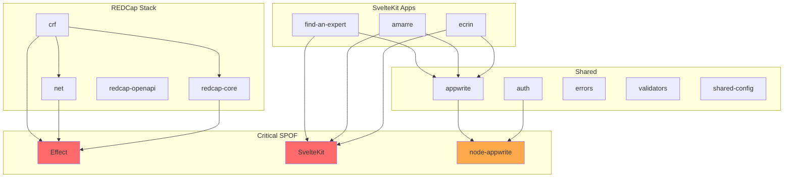

# Dependencies Audit

> **Last updated:** February 2, 2026

This document provides a comprehensive audit of all dependencies in the Atlas monorepo, covering licenses, versions, security vulnerabilities, and single points of failure (SPOF).

## Executive Summary

| Metric | Value | Status |
|--------|-------|:------:|
| Total dependencies | 1391 | - |
| Direct dependencies | ~60 | - |
| Security vulnerabilities | 6 (2 low, 4 moderate) | :warning: |
| Outdated packages | 16 | :yellow_circle: |
| License compliance | 100% | :white_check_mark: |
| SPOF identified | 4 critical | :warning: |

---

## Security Vulnerabilities

### Current Vulnerabilities (6 total)

| Package | Severity | CVE | Issue | Fix Available |
|---------|:--------:|-----|-------|:-------------:|
| `esbuild` | Moderate | GHSA-67mh | CORS vulnerability in dev server | :white_check_mark: >=0.25.0 |
| `cookie` | Low | CVE-2024-47764 | Cookie name injection | :white_check_mark: >=0.7.0 |
| `@eslint/plugin-kit` | Low | GHSA-xffm | ReDoS in ConfigCommentParser | :white_check_mark: >=0.3.4 |
| `lodash-es` | Moderate | CVE-2025-13465 | Prototype pollution in `_.unset`/`_.omit` | :white_check_mark: >=4.17.23 |
| `lodash` | Moderate | CVE-2025-13465 | Prototype pollution in `_.unset`/`_.omit` | :white_check_mark: >=4.17.23 |
| `js-yaml` | Moderate | CVE-2025-64718 | Prototype pollution in merge | :white_check_mark: >=4.1.1 |

### Vulnerability Details

#### esbuild (via vitepress > vite)
- **Path:** `.>vitepress>vite>esbuild`
- **Impact:** Development-only. Malicious websites could read dev server content.
- **Mitigation:** Update vite or wait for upstream fix.

#### lodash/lodash-es (via mermaid, @stoplight/prism-cli)
- **Path:** `.>mermaid>@mermaid-js/parser>langium>chevrotain>lodash-es`
- **Path:** `packages__crf>@stoplight/prism-cli>...>lodash`
- **Impact:** Prototype pollution via crafted input.
- **Mitigation:** Override in pnpm or wait for upstream fix.

#### js-yaml (via @modyfi/vite-plugin-yaml)
- **Path:** `.>@modyfi/vite-plugin-yaml>js-yaml`
- **Impact:** Prototype pollution when parsing untrusted YAML.
- **Mitigation:** Use `node --disable-proto=delete` or update plugin.

### Recommended pnpm Overrides

```json
{
  "pnpm": {
    "overrides": {
      "fast-xml-parser": ">=5.3.4",
      "lodash": ">=4.17.23",
      "lodash-es": ">=4.17.23",
      "js-yaml": ">=4.1.1"
    }
  }
}
```

---

## License Compliance

### Allowed Licenses

All dependencies use licenses compatible with MIT:

| License | Count | Compatible |
|---------|:-----:|:----------:|
| MIT | ~95% | :white_check_mark: |
| Apache-2.0 | ~3% | :white_check_mark: |
| BSD-3-Clause | ~1% | :white_check_mark: |
| BSD-2-Clause | <1% | :white_check_mark: |
| ISC | <1% | :white_check_mark: |
| 0BSD | <1% | :white_check_mark: |

### Notable Licenses

| Package | License | Note |
|---------|---------|------|
| TypeScript | Apache-2.0 | Microsoft |
| typedoc | Apache-2.0 | TypeStrong |
| eslint-plugin-security | Apache-2.0 | ESLint community |
| knip | ISC | Permissive |

### Verification Command

```bash
pnpm audit:licenses
# Uses: license-checker --onlyAllow "MIT;Apache-2.0;BSD-2-Clause;BSD-3-Clause;ISC;0BSD;Unlicense"
```

---

## Outdated Dependencies

### Minor/Patch Updates Available

| Package | Current | Latest | Age | Package |
|---------|---------|--------|-----|---------|
| @commitlint/cli | ^20.3.1 | ^20.4.0 | ~25d | root |
| @commitlint/config-conventional | ^20.3.1 | ^20.4.0 | ~25d | root |
| turbo | ^2.7.6 | ^2.8.1 | ~8d | root |
| @types/node | ^25.0.10 | ^25.2.0 | ~11d | multiple |
| svelte | ^5.48.5 | ^5.49.1 | ~5d | apps |
| svelte-check | ^4.3.5 | ^4.3.6 | ~1mo | apps |
| @scalar/hono-api-reference | ^0.9.37 | ^0.9.39 | ~8d | crf |
| eslint-plugin-turbo | ^2.7.6 | ^2.8.1 | ~8d | shared-config |

### Update Commands

```bash
# Check outdated dependencies
pnpm audit:versions

# Update all (writes to package.json)
pnpm taze -r -w

# Install and verify
pnpm install && pnpm ci
```

---

## Single Points of Failure (SPOF)

### Critical Dependencies

These dependencies are fundamental to the project with no easy alternatives:

| Dependency | Used By | Risk Level | Mitigation |
|------------|---------|:----------:|------------|
| **Effect** | crf, net, redcap-core | :red_circle: High | Core architecture choice. No alternative. |
| **SvelteKit** | find-an-expert, amarre, ecrin | :red_circle: High | Framework choice. Well-maintained by Svelte team. |
| **node-appwrite** | All SvelteKit apps | :orange_circle: Medium | Backend dependency. Appwrite is open-source. |
| **Hono** | crf server | :yellow_circle: Low | Lightweight. Easy to replace with Express/Fastify. |

### Dependency Analysis

#### Effect Ecosystem (Critical SPOF)
- **Packages:** effect, @effect/cli, @effect/platform, @effect/platform-node
- **Version:** 3.19.15 (synchronized)
- **Risk:** All REDCap packages depend on Effect
- **Mitigation:** Effect is actively maintained with strong community support
- **Bus factor:** Core team at Effect-TS

#### SvelteKit Ecosystem (Critical SPOF)
- **Packages:** @sveltejs/kit, svelte, @sveltejs/vite-plugin-svelte
- **Version:** 2.50.1 / 5.48.5 / 6.2.4
- **Risk:** 3 production applications depend on SvelteKit
- **Mitigation:** Backed by Vercel, large community
- **Bus factor:** Svelte team + Rich Harris (Vercel)

#### Appwrite (Medium SPOF)
- **Packages:** node-appwrite, appwrite (client)
- **Version:** 21.1.0 / 21.5.0
- **Risk:** Authentication and database for all apps
- **Mitigation:** Open-source, self-hosted option available
- **Bus factor:** Appwrite Inc.

### Dependency Graph



---

## Packages Overview

### Monorepo Structure (14 packages)

| Package | Type | Version | Key Dependencies |
|---------|------|---------|------------------|
| `atlas` (root) | Monorepo | - | turbo, vitest, vitepress |
| `find-an-expert` | SvelteKit app | 0.5.1 | svelte, zod, simple-git |
| `amarre` | SvelteKit app | 2.0.0 | svelte, luxon, zod |
| `ecrin` | SvelteKit app | 2.0.0 | svelte, sigma, graphology |
| `@univ-lehavre/crf` | REDCap client/server | 1.3.0 | effect, hono |
| `@univ-lehavre/atlas-redcap-openapi` | OpenAPI extraction | 1.3.0 | yaml, @clack/prompts |
| `@univ-lehavre/atlas-redcap-core` | Domain logic | 1.1.0 | effect |
| `@univ-lehavre/atlas-net` | Network utilities | 0.7.0 | effect, @effect/* |
| `@univ-lehavre/atlas-shared-config` | Config | 0.3.0 | typescript-eslint, eslint-plugin-* |
| `@univ-lehavre/atlas-appwrite` | Appwrite utils | 0.2.0 | node-appwrite |
| `@univ-lehavre/atlas-auth` | Auth service | 0.2.0 | node-appwrite |
| `@univ-lehavre/atlas-errors` | Error classes | 0.2.0 | - |
| `@univ-lehavre/atlas-validators` | Validation | 0.2.0 | - |
| `@univ-lehavre/atlas-logos` | Assets | 1.1.0 | - |
| `redcap-sandbox` | Testing | 1.0.1 | - |

---

## Standardized Versions

Target versions for consistency across the monorepo:

### Core Stack

| Dependency | Version | Status |
|------------|---------|:------:|
| Node.js | >=24.0.0 | :white_check_mark: |
| pnpm | 10.28.2 | :white_check_mark: |
| TypeScript | ^5.9.3 | :white_check_mark: |
| ESLint | ^9.39.2 | :white_check_mark: |
| Prettier | ^3.8.1 | :white_check_mark: |
| Vitest | ^4.0.18 | :white_check_mark: |

### SvelteKit Stack

| Dependency | Version | Status |
|------------|---------|:------:|
| @sveltejs/kit | ^2.50.1 | :white_check_mark: |
| @sveltejs/adapter-node | ^5.5.2 | :white_check_mark: |
| svelte | ^5.48.5 | :white_check_mark: |
| vite | ^7.3.1 | :white_check_mark: |

### Effect Stack

| Dependency | Version | Status |
|------------|---------|:------:|
| effect | ^3.19.15 | :white_check_mark: |
| @effect/cli | ^0.73.1 | :white_check_mark: |
| @effect/platform | ^0.94.2 | :white_check_mark: |
| @effect/platform-node | ^0.104.1 | :white_check_mark: |

### Hono Stack

| Dependency | Version | Status |
|------------|---------|:------:|
| hono | ^4.11.7 | :white_check_mark: |
| hono-openapi | ^1.2.0 | :white_check_mark: |
| @hono/node-server | ^1.19.9 | :white_check_mark: |

---

## Recommendations

### Immediate Actions (Priority 1)

| Action | Impact | Effort |
|--------|:------:|:------:|
| Add pnpm overrides for lodash/js-yaml | Security | Low |
| Update @commitlint packages | Maintenance | Low |
| Update turbo to 2.8.x | Performance | Low |

### Short-term Actions (Priority 2)

| Action | Impact | Effort |
|--------|:------:|:------:|
| Migrate tsup → tsc for utility packages | Consistency | Medium |
| Add tests for appwrite/auth packages | Quality | Medium |
| Document node-appwrite 21.x migration | Docs | Low |

### Long-term Actions (Priority 3)

| Action | Impact | Effort |
|--------|:------:|:------:|
| Evaluate Bun as alternative runtime | Performance | High |
| Automate dependency audits (Renovate) | Maintenance | Medium |
| Consider Effect alternatives for smaller packages | Flexibility | High |

---

## Audit Commands

```bash
# Full audit suite
pnpm ci:audit

# Individual audits
pnpm audit:security    # Security vulnerabilities
pnpm audit:licenses    # License compliance
pnpm audit:versions    # Outdated packages
pnpm audit:unused      # Unused dependencies (knip)
pnpm audit:duplicates  # Code duplication (jscpd)
pnpm audit:size        # Bundle size check
```

---

## History

| Date | Action |
|------|--------|
| February 2, 2026 | Complete audit with SPOF analysis |
| January 28, 2026 | Full update via `taze -r -w` |
| January 28, 2026 | Align node-appwrite 21.1.0 + API migration |
| January 28, 2026 | Initial audit |
