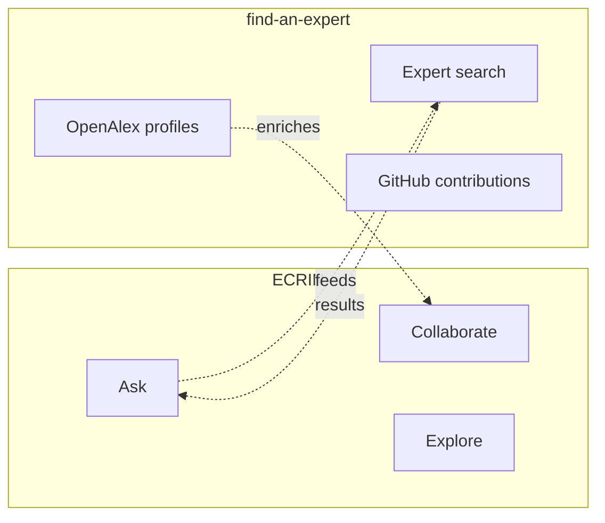

# ECRIN Application Audit

> **Last updated:** January 28, 2026

This document presents a complete audit of the ECRIN application, analyzing its architecture, its 6 functional cards and their potential to evolve into standalone applications.

## Executive Summary

ECRIN is a collaboration platform for researchers developed by Le Havre Normandie University as part of the Campus Polytechnique des Territoires Maritimes et Portuaires and EUNICoast projects.

| Metric | Value |
|--------|-------|
| Functional cards | 6 |
| Implemented cards | 3 (50%) |
| Candidate applications for extraction | 3 |
| Main technologies | SvelteKit 2, Svelte 5, Sigma.js, Appwrite |

### Subprojects

| Subproject | Status |
|------------|--------|
| introduce-my-scientific-questions | In progress |
| introduce-my-references | In progress |
| collaborate-create-my-project | In progress |
| collaborate-build-my-team | Planned |
| collaborate-find-my-expert | Planned |
| collaborate-fund-my-project | Planned |
| explore-my-graph | Planned |
| explore-community-graph | Planned |
| ask-data | Planned |
| ask-an-expert | In progress |
| publish-my-data | Planned |
| publish-my-news | Planned |

---

## 1. General Architecture

### 1.1 Overview

ECRIN is organized around **6 functional cards**, each representing a distinct business domain that could potentially evolve into a standalone application.

```
packages/ecrin/
├── src/
│   ├── routes/                    # SvelteKit routes
│   │   ├── +page.svelte          # Main page (6 cards)
│   │   ├── api/v1/               # REST API endpoints
│   │   ├── global/               # Graph visualization
│   │   └── login/                # Authentication
│   └── lib/
│       ├── ui/                   # Components for the 6 cards
│       ├── server/services/      # Business logic
│       ├── appwrite/             # Appwrite integration
│       ├── redcap/               # REDCap integration
│       └── graph/                # Graph generation
```

### 1.2 Technical Integrations

| System | Role | Usage |
|--------|------|-------|
| **REDCap** | Data source | Surveys, user records, projects |
| **Appwrite** | Backend | Authentication, sessions, database |
| **Sigma.js + Graphology** | Visualization | Research network graphs |

---

## 2. The 6 Functional Cards

### Overview

| Card | Component | Description | Backend status |
|------|-----------|-------------|:--------------:|
| **Introduce** | `Introduce.svelte` | Present research work | Interface only |
| **Collaborate** | `Collaborate.svelte` | Find collaborators and create projects | Functional |
| **Explore** | `Explore.svelte` | Visualize research networks | Functional |
| **Ask** | `Ask.svelte` | Search for data and experts | Interface only |
| **Publish** | `Publish.svelte` | Share data and news | Interface only |
| **Administrate** | `Administrate.svelte` | Manage account and surveys | Functional |

---

## 3. Card Details

### 3.1 "Introduce" Card (Present)

**File:** `packages/ecrin/src/lib/ui/Introduce.svelte`

**Objective:** Allow researchers to present their research work to get feedback from the community.

#### Sub-cards

| Sub-card | Description | Implementation |
|----------|-------------|:--------------:|
| My scientific question | Describe research to get feedback | Interface only |
| My references | Reference recent publications | Interface only |

#### Implementation Status

- **Frontend:** Interface structure present
- **Backend:** No integration

#### Recommendation

Integrate with **find-an-expert** to:
- Automatically retrieve publications via OpenAlex
- Build researcher profile from bibliographic data

---

### 3.2 "Collaborate" Card (Collaborate)

**File:** `packages/ecrin/src/lib/ui/Collaborate.svelte`

**Objective:** Facilitate the creation of collaborative projects and the building of research teams.

#### Sub-cards

| Sub-card | Description | Implementation |
|----------|-------------|:--------------:|
| Create my project | Declare a project to find collaborators | REDCap survey link |
| Build my team | Search for collaborators with specific skills | Partial |
| Find my expert | Connect with experts | Redirects to find-an-expert |
| Fund my project | Search for funding opportunities | Interface only |

#### Services Used

```typescript
// Backend services
surveysService.getSurveyUrl()      // Generates link to REDCap survey
accountService.pushAccountToRedcap() // Syncs account with REDCap
authService.signupWithEmail()       // Email registration
```

#### API Endpoints

| Method | Endpoint | Description |
|--------|----------|-------------|
| GET | `/api/v1/surveys/url` | Get REDCap survey URL |
| GET | `/api/v1/account/push` | Sync account with REDCap |

#### Extraction Potential

**High** - This card could become a `@univ-lehavre/ecrin-collaborator` package with:
- Research project management
- Collaborator search
- REDCap survey integration

---

### 3.3 "Explore" Card (Explore)

**File:** `packages/ecrin/src/lib/ui/Explore.svelte`

**Objective:** Visualize research networks through interactive graphs.

#### Sub-cards

| Sub-card | Description | Implementation |
|----------|-------------|:--------------:|
| My graph | Visualize personal network | Functional |
| Community graph | View community connections | Functional |

#### Technologies

| Library | Version | Usage |
|---------|---------|-------|
| Sigma.js | Latest | Graph rendering |
| Graphology | Latest | Graph data structure |
| ForceAtlas2 | Integrated | Layout algorithm |

#### API Endpoints

| Method | Endpoint | Description |
|--------|----------|-------------|
| GET | `/api/v1/graphs?record={id}` | User's personal graph |
| GET | `/api/v1/graphs/global` | Community graph |

#### Node Types

| Type | Color | Description |
|------|-------|-------------|
| Researcher | Yellow | Platform users |
| Project | Green | Research projects |
| Topic | Blue | Research domains |
| Keyword | Purple | Associated keywords |
| Method | Magenta | Research methods |
| Geographic area | Cyan | Geographic location |

#### Extraction Potential

**Very high** - This card is an excellent candidate for a `@univ-lehavre/ecrin-graph-explorer` package because:
- Standalone and reusable component
- Independent graph generation logic
- Can work with different data sources

---

### 3.4 "Ask" Card (Ask)

**File:** `packages/ecrin/src/lib/ui/Ask.svelte`

**Objective:** Allow researchers to find data and experts.

#### Sub-cards

| Sub-card | Description | Implementation |
|----------|-------------|:--------------:|
| Data | Search for data for research | Interface only |
| Expert by location | Find an expert in a geographic area | Interface only |
| Expert by topic | Find an expert on a subject | Interface only |
| Expert with data | Find an expert with relevant data | Interface only |

#### Implementation Status

- **Frontend:** Interface disabled (inactive buttons)
- **Backend:** Not implemented

#### Recommendation

**Merge with find-an-expert**:
- find-an-expert already provides expert search via OpenAlex and GitHub
- Avoids feature duplication
- Capitalizes on existing bibliographic data

---

### 3.5 "Publish" Card (Publish)

**File:** `packages/ecrin/src/lib/ui/Publish.svelte`

**Objective:** Allow researchers to share their work with the community.

#### Sub-cards

| Sub-card | Description | Implementation |
|----------|-------------|:--------------:|
| My data | Publish datasets | Interface only |
| My news | Write blog posts | Interface only |

#### Implementation Status

- **Frontend:** Interface structure present
- **Backend:** Not implemented

#### Prerequisites for Implementation

1. **File storage system** for datasets
2. **Content management system** for articles
3. **Moderation policy** for publications

#### Extraction Potential

**Medium** - Requires significant infrastructure before becoming a standalone package.

---

### 3.6 "Administrate" Card (Administer)

**File:** `packages/ecrin/src/lib/ui/Administrate.svelte`

**Objective:** Allow users to manage their account and data.

#### Sub-cards

| Sub-card | Description | Implementation |
|----------|-------------|:--------------:|
| My account - Register | Create an account | Functional |
| My account - Logout | End session | Functional |
| My account - Delete | Delete account | Functional |
| My survey - Subscribe | Accept data policy | Functional |
| My survey - Download | Export data (CSV/JSON) | Functional |
| My survey - Delete | Delete REDCap data | Functional |

#### Services Used

```typescript
// Authentication services
authService.signupWithEmail()    // Magic URL registration
authService.login()              // Session creation
authService.logout()             // Session destruction
authService.deleteUser()         // Account deletion

// Survey services
surveysService.getSurveyUrl()    // Survey link
surveysService.downloadSurvey()  // Data export
surveysService.deleteSurveyRecord() // REDCap deletion

// Account services
accountService.checkAccountPushed() // Status verification
```

#### API Endpoints

| Method | Endpoint | Description |
|--------|----------|-------------|
| POST | `/api/v1/auth/signup` | Email registration |
| POST | `/api/v1/auth/login` | Login |
| POST | `/api/v1/auth/logout` | Logout |
| DELETE | `/api/v1/auth/delete` | Account deletion |
| GET | `/api/v1/surveys/download` | Data download |
| DELETE | `/api/v1/surveys/delete` | Survey deletion |

#### Extraction Potential

**High** - Authentication logic is already partially extracted into `@univ-lehavre/atlas-auth`. This card could be generalized into:
- `@univ-lehavre/ecrin-account-manager` for account management
- Integration with the existing `auth` package

---

## 4. Relationship with find-an-expert

### 4.1 Functional Comparison

| Aspect | ECRIN | find-an-expert |
|--------|-------|----------------|
| **Main objective** | Collaboration and projects | Expertise discovery |
| **Data sources** | REDCap (declarative surveys) | OpenAlex, GitHub (public data) |
| **Expert search** | "Ask" card (not implemented) | Main feature |
| **Researcher profile** | Survey-based | Publication-based |
| **Status** | Main application | Specialized subproject |

### 4.2 Complementarity



### 4.3 Integration Recommendation

Position **find-an-expert as ECRIN's expertise discovery engine**:

1. ECRIN's "Ask" card redirects to find-an-expert
2. find-an-expert provides search results
3. find-an-expert profiles enrich ECRIN data

---

## 5. Recommendation Summary

### 5.1 Short Term

| Action | Priority | Effort |
|--------|:--------:|:------:|
| Integrate find-an-expert with "Ask" card | High | Medium |
| Document the 6 cards in ECRIN README | High | Low |
| Extract Graph component as reusable package | Medium | Medium |

### 5.2 Medium Term

| Action | Priority | Effort |
|--------|:--------:|:------:|
| Implement "Introduce" card with OpenAlex | Medium | High |
| Extract Collaborate logic as package | Low | Medium |
| Define architecture for "Publish" card | Low | High |

### 5.3 Candidate Packages for Extraction

| Proposed package | Source | Dependencies |
|------------------|--------|--------------|
| `@univ-lehavre/ecrin-graph-explorer` | Explore card | graphology, sigma |
| `@univ-lehavre/ecrin-collaborator` | Collaborate card | REDCap, Appwrite |
| `@univ-lehavre/ecrin-account-manager` | Administrate card | Appwrite, atlas-auth |

---

## 6. Appendix: Analyzed File Structure

```
packages/ecrin/src/lib/ui/
├── Introduce.svelte       # Introduce card
├── Collaborate.svelte     # Collaborate card
├── Explore.svelte         # Explore card
├── Ask.svelte             # Ask card
├── Publish.svelte         # Publish card
├── Administrate.svelte    # Administrate card
├── Options.svelte         # Admin options
├── Graph.svelte           # Visualization component
├── GraphSelector.svelte   # Graph view selector
├── CardItem.svelte        # Generic card component
├── HorizontalScroller.svelte # Horizontal scrolling
└── TopNavbar.svelte       # Navigation bar
```
