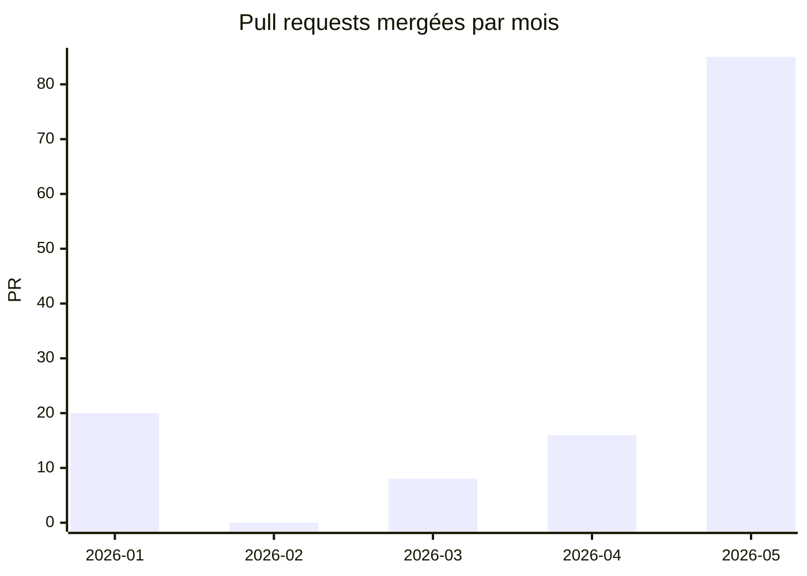
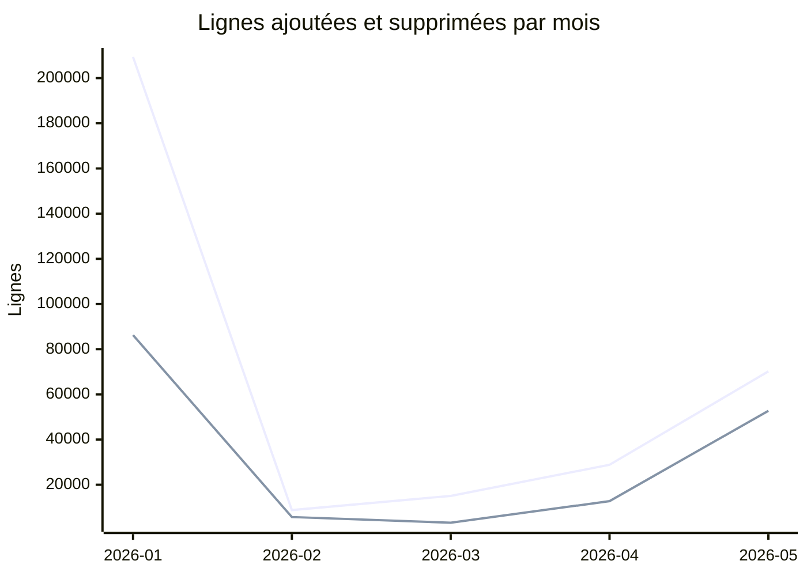
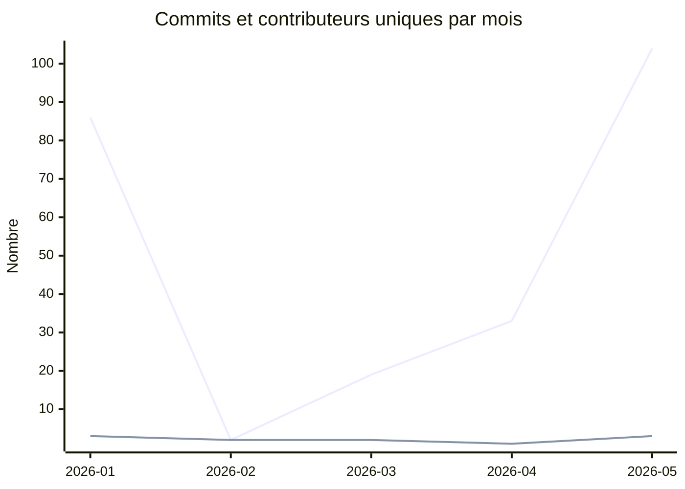
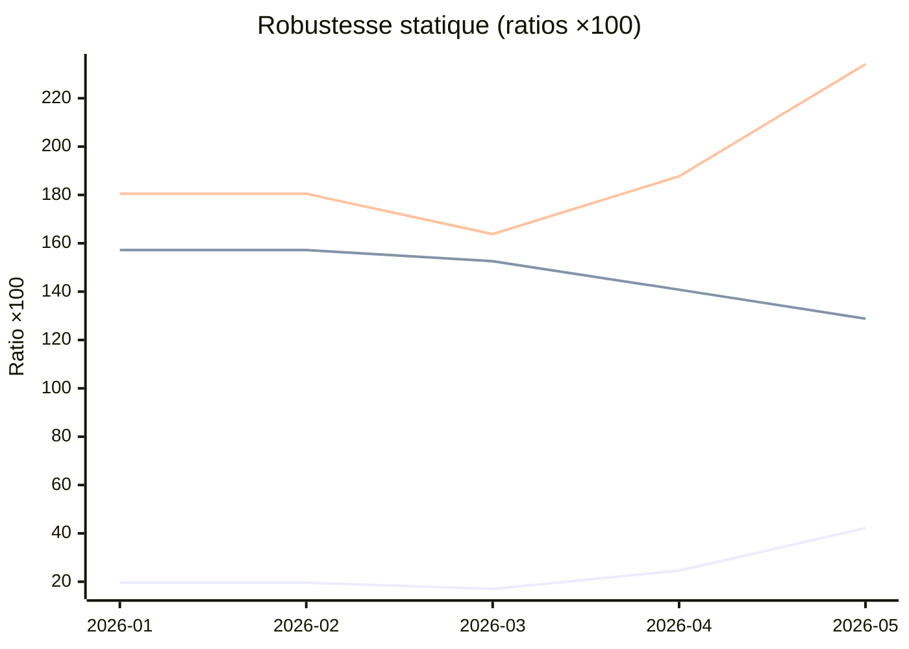

# Évolution du dépôt

Cette page retrace l'**évolution mensuelle** du dépôt depuis ses débuts : pull
requests mergées, volume de code, activité, et robustesse. Toutes ces courbes
sont **dérivées de l'historique Git** — donc reproductibles à l'identique — et
vérifiées à jour en CI (classe A de l'[ADR 0032](../decisions/0032-kpi-determinisme-vs-snapshot.md)).

> **Page générée.** Le contenu ci-dessous est produit par
> `scripts/docs/generate-kpi-history.ts` à partir de `git log`. Ne l'éditez pas
> à la main : lancez `pnpm docs:generate` puis commitez le résultat. La
> robustesse est mesurée par **analyse statique** des arbres Git, jamais en
> exécutant les tests (la couverture mesurée, non reproductible, est historisée
> ailleurs — cf. [tableau de bord](./tableau-de-bord.md)).

> **Le mois en cours n'est pas affiché.** Seuls les **mois clos** figurent ici :
> un mois en cours change à chaque commit, ce qui périmerait la page à chaque
> _pull request_. La page ne fige donc que ce qui est définitivement stable
> (esprit de l'[ADR 0032](../decisions/0032-kpi-determinisme-vs-snapshot.md)).

## Pull requests mergées par mois

## Lignes de code par mois

_Deux séries : lignes ajoutées (haute) et lignes supprimées (basse)._

## Commits et contributeurs par mois

_Deux séries : commits (haute) et contributeurs uniques (basse)._

## Robustesse statique par mois

Mesurée par **analyse statique** du dernier arbre `--first-parent` de chaque
mois (jamais en exécutant les tests). Trois ratios, multipliés par 100 pour
la lisibilité :

_Trois séries : fichiers de test / fichiers source · commentaires TSDoc /
surface exportée · blocs de test / surface exportée._

| Mois    | Commit         | Tests/Source | TSDoc/Surface | Tests/Surface |
| ------- | -------------- | ------------ | ------------- | ------------- |
| 2026-01 | `3d8d2a740bb4` | 19.600       | 157.200       | 180.500       |
| 2026-02 | `36569427a4fe` | 19.600       | 157.200       | 180.500       |
| 2026-03 | `9f08556638a6` | 17           | 152.600       | 163.800       |
| 2026-04 | `ab331fc13b42` | 24.600       | 140.800       | 187.700       |
| 2026-05 | `84b8f12d2c47` | 42.200       | 128.800       | 234.100       |
