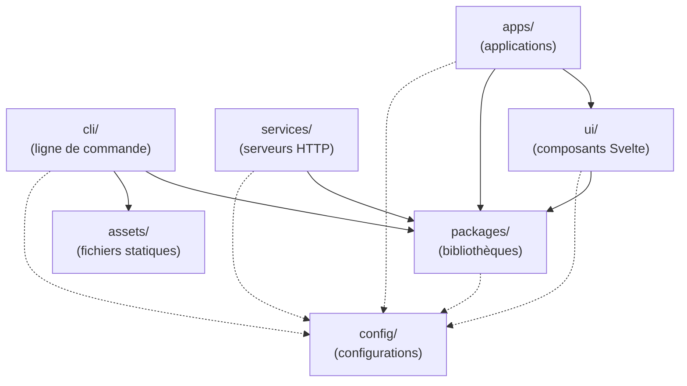

import ActivityBadge from "../../../components/kpi/ActivityBadge.vue";
import PackagesBadge from "../../../components/kpi/PackagesBadge.vue";

Un **monorepo** est un seul dépôt Git qui héberge plusieurs projets logiciels, avec des règles partagées. Atlas en est un. **Git** est le système de gestion de versions distribué qui enregistre l'historique du code (qui a modifié quoi, quand) et permet à plusieurs personnes de travailler en parallèle ; un **dépôt** est l'ensemble du projet versionné par Git.

Atlas organise ses projets en **neuf catégories**. Huit relèvent du périmètre Node/TypeScript ; la neuvième, `dataops/`, héberge le code DataOps en Python (Dagster, dbt). Chaque catégorie a une responsabilité précise et des **règles propres** : framework imposé (un **framework** est un socle logiciel qui fournit une structure et des composants prêts à l'emploi, sur lesquels on bâtit son application au lieu de tout réécrire), dépendances autorisées ou interdites, présence ou absence d'un point d'entrée exécutable, etc. Le placement d'un sous-projet dans une catégorie indique d'emblée son rôle, et les règles des huit catégories Node sont vérifiées automatiquement par `pnpm audit:structure` (`dataops/`, en Python, en est exempté — voir [ADR 0055](/atlas/decisions/0055-categorie-dataops-python/)).

<PackagesBadge client:load />

<ActivityBadge client:load />

## Vue d'ensemble

Les catégories répartissent le code selon ce qu'il **fait** et **qui le consomme** : des applications livrées aux utilisateurs (`apps/`), des bibliothèques de logique métier réutilisables (`packages/`), des serveurs HTTP de backend (`services/`), des outils en ligne de commande (`cli/`), des composants d'interface partagés (`ui/`), des fichiers statiques versionnés (`assets/`), des configurations communes (`config/`), des environnements de test isolés (`sandbox/`) et le code DataOps en Python (`dataops/`). Cette répartition est utile parce qu'elle rend le rôle d'un sous-projet lisible d'un coup d'œil et permet d'imposer à chaque catégorie ses propres contraintes (framework, dépendances, publication). Le tableau ci-dessous résume, pour chaque catégorie, son contenu, sa convention de nommage et si elle est publiée sur npm — le registre public de paquets JavaScript/TypeScript.

| Catégorie                                                               | Contenu                                                      | Convention de nommage                                 | Publié sur npm ?      |
| ----------------------------------------------------------------------- | ------------------------------------------------------------ | ----------------------------------------------------- | --------------------- |
| [`apps/`](https://github.com/univ-lehavre/atlas/tree/main/apps)         | Applications web destinées aux utilisateurs finaux           | `@univ-lehavre/atlas-<nom-du-dossier>`                | Non (`private: true`) |
| [`assets/`](https://github.com/univ-lehavre/atlas/tree/main/assets)     | Fichiers statiques versionnés (logos, images, polices)       | `@univ-lehavre/atlas-<nom>`                           | Variable              |
| [`packages/`](https://github.com/univ-lehavre/atlas/tree/main/packages) | Bibliothèques TypeScript réutilisables                       | `@univ-lehavre/atlas-<nom>`                           | Oui                   |
| [`services/`](https://github.com/univ-lehavre/atlas/tree/main/services) | Serveurs HTTP déployés en backend                            | `@univ-lehavre/atlas-<nom>`                           | Oui                   |
| [`cli/`](https://github.com/univ-lehavre/atlas/tree/main/cli)           | Outils en ligne de commande, courts, qui consomment les libs | `@univ-lehavre/atlas-<nom>-cli` (dossier sans `-cli`) | Oui                   |
| [`ui/`](https://github.com/univ-lehavre/atlas/tree/main/ui)             | Composants d'interface Svelte partagés                       | `@univ-lehavre/atlas-ui`                              | Variable              |
| [`config/`](https://github.com/univ-lehavre/atlas/tree/main/config)     | Configurations communes (style, types, formatage)            | `@univ-lehavre/atlas-<nom>-config`                    | Oui                   |
| [`sandbox/`](https://github.com/univ-lehavre/atlas/tree/main/sandbox)   | Environnements Docker pour tests d'intégration               | Pas de convention spécifique                          | Non                   |
| [`dataops/`](https://github.com/univ-lehavre/atlas/tree/main/dataops)   | Code DataOps en **Python** (assets Dagster, modèles dbt)     | Dossier Python (uv) ; hors graphe pnpm                | Non                   |

## Diagramme des dépendances

Le diagramme ci-dessous montre **quelles catégories ont le droit de dépendre de quelles autres**. On le regarde pour vérifier que les dépendances vont toujours dans le bon sens : le code réutilisable (en bas) ne doit jamais dépendre du code qui le consomme (en haut), ce qui garantit un graphe sans cycle et des bibliothèques restant indépendantes de leurs usages.

Les flèches indiquent **« utilise »**. Les projets en haut dépendent de ceux en bas, jamais l'inverse.



Trait plein : dépendance d'exécution. Trait pointillé : dépendance de développement (configurations TypeScript, ESLint, Prettier).

`sandbox/` est isolé : **aucune autre catégorie ne peut dépendre d'un projet de `sandbox/`**.

`dataops/` (Python) **ne figure pas dans ce graphe** : il ne dépend d'aucun paquet TypeScript et n'est dépendu par aucun. Sa seule interface avec le reste du dépôt est le contrat Parquet + `manifest.json` sur le stockage objet ([ADR 0055](/atlas/decisions/0055-categorie-dataops-python/)), pas une dépendance de code.

## Principes par catégorie

Chaque catégorie a une responsabilité unique. Les règles ci-dessous sont enforcées par le script `pnpm audit:structure` (cf. [scripts/audit/workspace-structure.mjs](https://github.com/univ-lehavre/atlas/blob/main/scripts/audit/workspace-structure.mjs)).

### `apps/` — applications utilisateur

**Rôle.** Front-end SvelteKit déployable, livré à des utilisateurs finaux. Chaque app a son cycle de vie (déploiement, versionnage applicatif via Changesets, _bundle_) indépendant.

**Règles.**

- Le nom du paquet est `@univ-lehavre/atlas-<nom-du-dossier>` (le préfixe `atlas-` est ajouté automatiquement si le dossier ne commence pas par `atlas-`).
- `private: true` — une app n'est jamais publiée sur npm.
- Doit dépendre de `@sveltejs/kit` **et** `svelte`.
- Pas de `bin` field (une app n'est pas un exécutable en ligne de commande).
- **Ne peut pas dépendre d'une autre app** — le code partagé doit être extrait vers `packages/` ou `ui/`.

### `packages/` — bibliothèques réutilisables

**Rôle.** Code métier, pur, sans dépendance vers une interface utilisateur ni vers un terminal. C'est le cœur logique du dépôt, consommé par `apps/`, `services/`, `cli/` et `ui/`.

**Règles.**

- Pas de `bin` field — les exécutables en ligne de commande vivent dans `cli/`.
- **Pas de dépendance d'I/O terminal.** Les bibliothèques d'interaction CLI (`@clack/prompts`, `yargs`, `commander`, `meow`, `inquirer`, `prompts`) sont interdites en `dependencies`.
- **Pas d'import de modules terminal.** `node:readline`, `node:tty`, `'readline'`, `'tty'` sont interdits dans les sources `packages/*/src/`.
- **Pas de Svelte ni SvelteKit en `dependencies`.** Si une bibliothèque a besoin de types Svelte, les déclarer en `peerDependencies` (optionnel) ou en `devDependencies` (pour le développement). Les imports runtime de `svelte`, `@sveltejs/kit`, `$app/`, `$lib/` sont interdits dans les sources.
- **Pas de framework HTTP de routage** (`hono`, `express`, `fastify`, `koa`, `polka`) — le routage HTTP appartient à `services/`.
- **Objectif de couverture de tests** élevé (cible 100 %), car ces bibliothèques sont consommées partout.

### `services/` — serveurs HTTP

**Rôle.** Serveurs HTTP déployés en backend (par exemple : un service de proxy vers REDCap). Utilisent le framework [Hono](https://hono.dev/).

**Règles.**

- Pas de `bin` field.
- **Doit dépendre de `hono`.**
- **Doit dépendre d'au moins un paquet `@univ-lehavre/atlas-*` interne** — la logique métier vit dans `packages/`, le service est une fine couche de routage.
- **Ne peut pas dépendre d'un autre service** — la logique commune doit être extraite vers `packages/`.

### `cli/` — outils en ligne de commande

**Rôle.** Exécutables Node.js exposés à l'utilisateur en ligne de commande. Restent **fins** : parsent les arguments, appellent une bibliothèque de `packages/`, formatent la sortie.

**Règles.**

- **Le dossier ne doit pas se terminer par `-cli`.** Exemple : `cli/net/` (pas `cli/net-cli/`).
- **Le paquet doit se terminer par `-cli`** sauf exception explicitée dans le script d'audit (cas historique : `@univ-lehavre/atlas-crf-openapi`).
- **Doit avoir un `bin` field** pointant vers l'exécutable.
- **Doit dépendre d'au moins un paquet `@univ-lehavre/atlas-*` interne** — la logique métier vit dans `packages/`, le CLI est une fine couche d'I/O terminal.
- C'est ici que vivent les dépendances d'I/O terminal (`@clack/prompts`, `yargs`, etc.).

### `ui/` — composants d'interface partagés

**Rôle.** Bibliothèque de composants Svelte réutilisés par plusieurs applications.

**Règles.**

- Pas de `bin` field.
- **`svelte` doit être déclaré en `peerDependencies`**, pas en `dependencies` — l'application hôte fournit sa version.
- **Pas de dépendances CLI I/O** ni HTTP de routage.
- **Pas d'imports server-only** dans les sources : `@sveltejs/kit/node`, `server-only`, `$env/static/private`, `$env/dynamic/private` sont interdits. La logique serveur appartient aux _hooks_ SvelteKit des applications (`apps/<nom>/src/hooks.server.ts`).

### `config/` — configurations communes

**Rôle.** Paquets qui exportent des configurations partagées (préréglages ESLint, TypeScript, Prettier, etc.). Consommés par tous les autres projets.

**Règles.**

- Pas de `bin` field.
- Doit pouvoir être consommé via `import` dans un fichier de configuration (par exemple `eslint.config.js` qui importe `@univ-lehavre/atlas-shared-config`).

### `assets/` — fichiers statiques

**Rôle.** Fichiers statiques versionnés : logos, images, polices, données figées. **Aucun code exécutable.** Consommés par les apps (souvent via un CLI d'installation qui copie les fichiers vers le dossier `static/` de l'app).

**Règles.**

- Pas de `bin` field — un outil d'installation va dans `cli/`, jamais ici.
- **Pas de dépendances runtime** (`dependencies` doit être vide ou absent). Les _devDependencies_ sont autorisées (par exemple `vitest` pour vérifier la présence des fichiers).
- Peut être publié sur npm (cas de `@univ-lehavre/atlas-logos`) ou privé selon le besoin.

### `sandbox/` — environnements de test

**Rôle.** Stacks Docker Compose pour reproduire localement les dépendances externes (Appwrite, REDCap, Mailpit, etc.) afin d'exécuter les tests d'intégration et les scénarios _end-to-end_.

**Règles.**

- **Isolation totale** : aucune autre catégorie (`apps/`, `packages/`, etc.) ne peut dépendre d'un paquet de `sandbox/`. Les dépendances vont uniquement dans l'autre sens : `sandbox/` peut importer du code du dépôt pour ses besoins propres.
- Pas publié sur npm.

### `dataops/` — code DataOps en Python

**Rôle.** Le code de la plateforme **DataOps** (application au traitement de données des pratiques d'automatisation et de qualité du DevOps) : assets **Dagster** (orchestrateur de pipelines de données), modèles **dbt** (transformation SQL versionnée), code de synchronisation de données. Ces outils sont écrits en Python et n'ont pas d'équivalent TypeScript ; cette catégorie accueille donc du **Python natif**, à rebours du reste du dépôt ([ADR 0055](/atlas/decisions/0055-categorie-dataops-python/)).

**Règles.**

- **Python natif**, outillé par **uv** (environnement et dépendances), **ruff** (lint et format) et **pytest** (tests). Le `uv.lock` est versionné.
- **Au workspace, mais pour le cache seulement** : les deux **code-locations Dagster** (`dataops/citation-dagster`, `dataops/mediawatch-dagster`) sont déclarées dans `pnpm-workspace.yaml` via un `package.json` privé. Cette déclaration sert **uniquement** à les faire entrer dans le cache **Turbo** ([ADR 0066](/atlas/decisions/0066-cache-turbo-dataops/)) : leurs scripts `lint:py`, `test:py` et `manifests:py` délèguent à uv/ruff/pytest, et Turbo mémorise leurs résultats. En contrepartie, knip les **exclut** explicitement et `audit:structure` **ignore** le Python — sa discipline relève de ruff/pytest.
- **Frontière par le contrat** : `dataops/` ne dépend d'aucun paquet TypeScript et n'est dépendu par aucun. Sa seule interface avec le reste du dépôt est le **contrat Parquet + `manifest.json`** sur le stockage objet ([ADR 0029](/atlas/decisions/0029-architecture-pipeline-collaborations/) / [0054](/atlas/decisions/0054-ingestion-massive-snapshot-s3/)).
- Pas publié sur npm.

## Conventions transverses

### Nommage des paquets

- Tous les paquets internes sont préfixés par `@univ-lehavre/atlas-`.
- Le chemin du dossier dans le dépôt correspond au suffixe : `packages/auth/` → `@univ-lehavre/atlas-auth`.

### `repository.directory`

Si le `package.json` déclare un champ `repository.directory`, il **doit** correspondre au chemin réel du paquet dans le dépôt. Permet à npm d'afficher correctement le lien « source » dans la page du paquet.

### Pas de cycles de dépendances

Le script d'audit détecte les cycles dans le graphe des dépendances internes (`@univ-lehavre/atlas-*` → `@univ-lehavre/atlas-*`) et fait échouer la vérification. Un cycle signale une responsabilité mal placée : il faut extraire la zone commune dans un nouveau paquet `packages/*`.

## Vérifier la structure

Avant d'ouvrir une pull request qui ajoute, déplace ou modifie un sous-projet :

```bash
pnpm audit:structure
```

Le script signale, ligne par ligne, chaque écart par rapport aux règles ci-dessus. Il est lancé en CI dans le _workflow_ `ci.yml` (job `audit`).

## Outils du monorepo

Trois outils principaux organisent la vie quotidienne du dépôt :

- **[pnpm](https://pnpm.io/)** (gestionnaire de paquets) installe les dépendances en partageant un cache global et isole chaque sous-projet via les _workspaces_ (fichier [`pnpm-workspace.yaml`](https://github.com/univ-lehavre/atlas/blob/main/pnpm-workspace.yaml))
- **[turbo](https://turbo.build/)** (orchestrateur de tâches) parallélise les commandes (`build`, `test`, `lint`…) à travers les sous-projets et met en cache les résultats : un projet déjà construit n'est pas reconstruit
- **[Changesets](https://github.com/changesets/changesets)** gère le versionnage : chaque pull request qui modifie un paquet publiable joint un fichier `.changeset/*.md` décrivant le changement et son impact (`patch`, `minor`, `major`)

## Répertoires hors-workspace

Les huit catégories ci-dessus décrivent les **sous-projets** (workspaces pnpm).
À côté, quelques répertoires racine **ne sont pas des workspaces** : ils portent
l'outillage, les correctifs de dépendances et les données de test. Chacun a son
propre README.

| Répertoire                                                              | Rôle                                                                                                                                                             |
| ----------------------------------------------------------------------- | ---------------------------------------------------------------------------------------------------------------------------------------------------------------- |
| [`scripts/`](https://github.com/univ-lehavre/atlas/tree/main/scripts)   | Automatisations transverses, **non publiables** : audits (`audit/`), génération de documentation (`docs/`), publication (`release/`), trames CRF (`crf-trame/`). |
| [`patches/`](https://github.com/univ-lehavre/atlas/tree/main/patches)   | Correctifs locaux appliqués à des dépendances externes (patches pnpm), versionnés et documentés.                                                                 |
| [`fixtures/`](https://github.com/univ-lehavre/atlas/tree/main/fixtures) | Jeux de données de test versionnés (ex. dictionnaires REDCap anonymisés), consommés par les tests d'intégration.                                                 |

- **`scripts/`** regroupe ce qui fait vivre le dépôt sans être livré sur npm :
  l'audit de structure ([`audit/`](https://github.com/univ-lehavre/atlas/tree/main/scripts/audit)),
  les générateurs de la documentation
  ([`docs/`](https://github.com/univ-lehavre/atlas/tree/main/scripts/docs) — carte
  des paquets, référence API, statistiques du dépôt), les scripts de publication
  ([`release/`](https://github.com/univ-lehavre/atlas/tree/main/scripts/release))
  et la génération des trames et fixtures CRF
  ([`crf-trame/`](https://github.com/univ-lehavre/atlas/tree/main/scripts/crf-trame)).
- **`patches/`** conserve les correctifs maintenus dans le dépôt pour ajuster une
  dépendance externe quand c'est nécessaire — chaque patch documente une
  modification locale appliquée par le gestionnaire de paquets.
- **`fixtures/`** porte les données de test partagées : par exemple
  [`crf-projects/`](https://github.com/univ-lehavre/atlas/tree/main/fixtures/crf-projects),
  des dictionnaires de données REDCap-importables et **anonymisés** (substitution
  déterministe de _fake names_, aucune donnée réelle), générés par
  `scripts/crf-trame/`.
