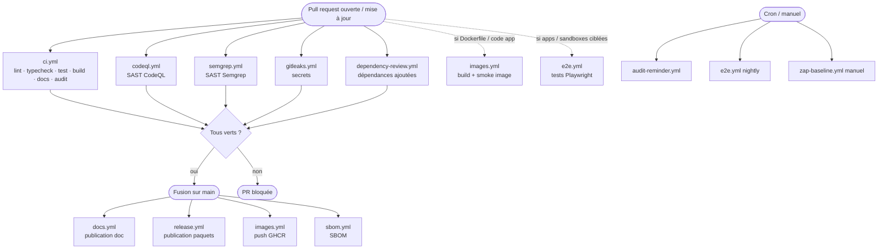
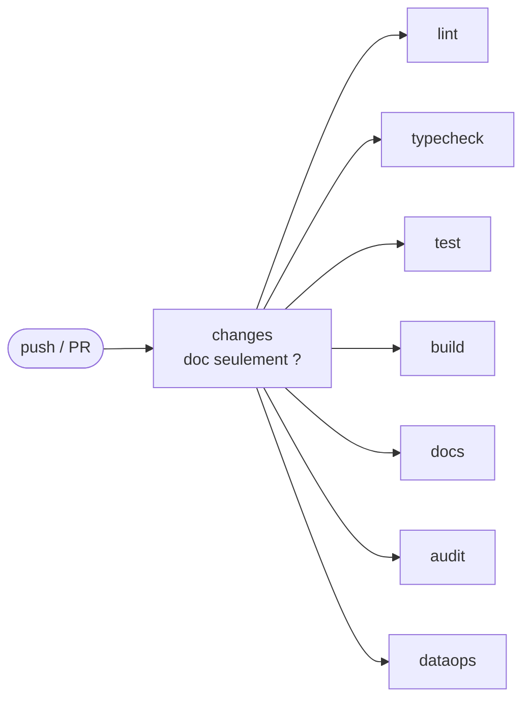

L'**intégration continue** (CI, _Continuous Integration_) désigne l'ensemble des vérifications automatiques rejouées chaque fois qu'un contributeur propose une modification du code. Quelques termes de base, employés partout dans cette page :

- une **branche** est une ligne de travail isolée, dérivée de la branche de référence `main`, sur laquelle on développe sans perturber le reste ;
- un **commit** est un enregistrement daté d'un lot de modifications, accompagné d'un message qui en explique l'intention ;
- **pousser** (_push_) consiste à envoyer ses commits locaux vers GitHub ;
- une **pull request** (PR) est la proposition publiée sur GitHub de fusionner une branche dans `main`. Elle permet la revue par un autre humain **et** déclenche la CI ; elle n'est fusionnée qu'une fois ces deux conditions satisfaites.

Atlas orchestre la CI via **[GitHub Actions](https://github.com/features/actions)**, le service intégré à GitHub qui exécute des _workflows_ (suites de commandes décrites dans des fichiers `.github/workflows/*.yml`) sur des machines virtuelles à chaque événement (push, pull request, ou horaire programmé _cron_).

Objectif : aucun code non vérifié n'entre dans `main`. Si une vérification échoue, la pull request est bloquée tant que l'auteur n'a pas corrigé.

## Vue d'ensemble

Le dépôt compte **quatorze _workflows_** qui se répartissent selon **quand** ils se déclenchent. L'enchaînement type, du point de vue d'un contributeur, est le suivant :

1. **À l'ouverture (ou à la mise à jour) d'une pull request**, plusieurs _workflows_ démarrent **en parallèle** : la chaîne qualité (`ci.yml`), les analyses de sécurité du code (`codeql.yml`, `semgrep.yml`), la détection de secrets (`gitleaks.yml`) et la revue des dépendances ajoutées (`dependency-review.yml`). Certains ne se réveillent **que si la PR touche les fichiers concernés** : `images.yml` (construction des images Docker, sur tout changement de code applicatif ou de `Dockerfile`) et `e2e.yml` (tests de bout en bout, seulement si la PR touche les apps ou _sandboxes_ ciblées). **Toutes ces vérifications doivent passer** pour que la PR soit fusionnable.
2. **À la fusion sur `main`** (après revue), d'autres _workflows_ prennent le relais : publication de la documentation (`docs.yml`), publication des paquets (`release.yml`), construction et publication des images Docker (`images.yml`), génération du SBOM (`sbom.yml`) et analyse de référence CodeQL (`codeql.yml` tourne aussi sur `main`).
3. **Sur déclencheur programmé (_cron_) ou manuel**, indépendamment des PR : le rappel d'audit trimestriel (`audit-reminder.yml`), les tests de bout en bout nocturnes (`e2e.yml`), l'analyse CodeQL hebdomadaire et le scan dynamique ZAP (`zap-baseline.yml`, **manuel uniquement**). En continu, `dependabot-auto-merge.yml` réagit aux pull requests ouvertes par le robot Dependabot.

Le diagramme suivant résume **quels _workflows_ se déclenchent à chaque moment** ; chaque case est détaillée plus bas.



Le tableau ci-dessous récapitule le rôle de chaque _workflow_. Les sections suivantes détaillent d'abord `ci.yml` (le plus structurant), puis chacun des autres.

**Sur pull request** (et la plupart aussi sur `main`) :

| Workflow                                                                                                           | Rôle                                                                           |
| ------------------------------------------------------------------------------------------------------------------ | ------------------------------------------------------------------------------ |
| [`ci.yml`](https://github.com/univ-lehavre/atlas/blob/main/.github/workflows/ci.yml)                               | Chaîne qualité : lint, typecheck, tests, build, documentation, audits          |
| [`codeql.yml`](https://github.com/univ-lehavre/atlas/blob/main/.github/workflows/codeql.yml)                       | Analyse statique de sécurité (SAST) avec CodeQL                                |
| [`semgrep.yml`](https://github.com/univ-lehavre/atlas/blob/main/.github/workflows/semgrep.yml)                     | Analyse statique de sécurité (SAST) avec Semgrep, complémentaire à CodeQL      |
| [`gitleaks.yml`](https://github.com/univ-lehavre/atlas/blob/main/.github/workflows/gitleaks.yml)                   | Détection de secrets committés                                                 |
| [`dependency-review.yml`](https://github.com/univ-lehavre/atlas/blob/main/.github/workflows/dependency-review.yml) | Revue des nouvelles dépendances (vulnérabilités, licences)                     |
| [`images.yml`](https://github.com/univ-lehavre/atlas/blob/main/.github/workflows/images.yml)                       | Construction des images Docker + test de démarrage (_smoke_)                   |
| [`e2e.yml`](https://github.com/univ-lehavre/atlas/blob/main/.github/workflows/e2e.yml)                             | Tests de bout en bout (Playwright) sur les _sandboxes_                         |
| [`pr-issue-link.yml`](https://github.com/univ-lehavre/atlas/blob/main/.github/workflows/pr-issue-link.yml)         | Avertit (non bloquant) si une PR référence une issue sans mot-clé de fermeture |

**Sur `main` (après fusion)** :

| Workflow                                                                                       | Rôle                                                  |
| ---------------------------------------------------------------------------------------------- | ----------------------------------------------------- |
| [`docs.yml`](https://github.com/univ-lehavre/atlas/blob/main/.github/workflows/docs.yml)       | Publication du site de documentation sur GitHub Pages |
| [`release.yml`](https://github.com/univ-lehavre/atlas/blob/main/.github/workflows/release.yml) | Publication des paquets sur npm via Changesets        |
| [`images.yml`](https://github.com/univ-lehavre/atlas/blob/main/.github/workflows/images.yml)   | Publication des images Docker sur GHCR                |
| [`sbom.yml`](https://github.com/univ-lehavre/atlas/blob/main/.github/workflows/sbom.yml)       | Génération du SBOM (inventaire des dépendances)       |

**Programmés (_cron_) ou manuels** :

| Workflow                                                                                                                   | Rôle                                                                |
| -------------------------------------------------------------------------------------------------------------------------- | ------------------------------------------------------------------- |
| [`audit-reminder.yml`](https://github.com/univ-lehavre/atlas/blob/main/.github/workflows/audit-reminder.yml)               | Ouvre une issue de rappel d'audit transverse trimestriel            |
| [`zap-baseline.yml`](https://github.com/univ-lehavre/atlas/blob/main/.github/workflows/zap-baseline.yml)                   | Scan dynamique OWASP ZAP (DAST) — déclenchement manuel              |
| [`dependabot-auto-merge.yml`](https://github.com/univ-lehavre/atlas/blob/main/.github/workflows/dependabot-auto-merge.yml) | Auto-merge des montées de dépendances sûres ouvertes par Dependabot |

## Le workflow `ci.yml` en détail

`ci.yml` est la chaîne qualité du dépôt. Il regroupe plusieurs _jobs_ (un _job_ est un groupe d'étapes exécuté sur une machine dédiée). Un premier _job_, `changes`, détecte si la PR ne touche que de la documentation : dans ce cas, les _jobs_ lourds (`lint`, `typecheck`, `test`, `build`, `audit`) sautent leur travail coûteux tout en restant « verts » (CI adaptative, [ADR 0034](/atlas/decisions/0034-ci-adaptative-par-chemin/)). Tous les autres _jobs_ ne dépendent **que** de `changes` (`needs: [changes]`) : ils partent donc **tous en parallèle** dès que `changes` a répondu, sans aucune barrière d'attente entre eux. C'est un choix assumé d'accélération ([ADR 0061](/atlas/decisions/0061-ci-acceleration-cache-parallelisation/)) : chaîner `build` derrière `lint`/`typecheck`/`test` n'ajoutait que de l'attente, car ce sont des contrôles de qualité indépendants et non des prérequis de compilation. L'ordre réel des tâches de build (un paquet avant ceux qui en dépendent, `^build`) est géré **à l'intérieur** de chaque _job_ par Turbo, pas par l'enchaînement des _jobs_.

Le graphe ci-dessous montre cet enchaînement et les conditions de passage :



`changes` démarre seul dès le push. Tous les autres _jobs_ (`lint`, `typecheck`, `test`, `build`, `docs`, `audit`, `dataops`) attendent uniquement sa réponse, puis s'exécutent **en parallèle** : aucun n'attend un autre. Chacun lit le résultat de `changes` (drapeau `RUN`) pour décider s'il saute son travail coûteux sur une PR documentaire, tout en sortant toujours « vert » (jamais `skipped`, qui resterait « Pending » et bloquerait le merge — [ADR 0034](/atlas/decisions/0034-ci-adaptative-par-chemin/)).

### `lint`

Le [_lint_](/atlas/glossary/) analyse le code **sans l'exécuter** pour repérer les erreurs de style et les motifs dangereux (variables non utilisées, expressions régulières coûteuses, oublis de formatage). C'est la première barrière : elle attrape les défauts les moins chers à corriger.

```bash
pnpm format:check     # Prettier vérifie le formatage
pnpm lint             # ESLint applique les règles de style/sécurité
```

### `typecheck`

Le [_typecheck_](/atlas/glossary/) vérifie que tous les types TypeScript sont cohérents (une valeur déclarée comme texte n'est jamais utilisée comme nombre). Il attrape une classe entière de bugs avant même l'exécution.

```bash
pnpm typecheck        # TypeScript vérifie les types
pnpm svelte:check     # Vérification supplémentaire pour les fichiers .svelte
```

### `test`

Les **tests** exécutent le code avec des données connues pour vérifier qu'il produit le résultat attendu (voir [Tests](/atlas/quality/tests/)). On mesure en plus la [_couverture_](/atlas/glossary/) : la proportion du code réellement exercée par au moins un test.

```bash
pnpm test:coverage    # Tous les tests avec mesure de couverture
```

### `build`

Le **build** (compilation) transforme le code source en artefacts prêts à être exécutés ou publiés : chaque sous-projet est compilé, puis on vérifie que la taille des fichiers livrés au navigateur (_bundle_) ne dépasse pas le budget fixé. Cette étape attrape les erreurs qui n'apparaissent qu'à la compilation et garde les pages légères pour l'utilisateur final.

```bash
pnpm build            # Compilation de chaque sous-projet
pnpm audit:size       # Vérifie les budgets de taille de bundle
```

`build` ne dépend plus de `lint`, `typecheck` ni `test` : il part en parallèle d'eux dès la réponse de `changes` ([ADR 0061](/atlas/decisions/0061-ci-acceleration-cache-parallelisation/)). Ces vérifications sont des contrôles de qualité indépendants, pas des prérequis de compilation ; l'ordre interne des paquets (`^build`) est assuré par Turbo.

### `audit`

L'**audit** inspecte les dépendances et le code à la recherche de vulnérabilités, de licences incompatibles, de code mort, de duplication ou de versions obsolètes. C'est le contrôle d'hygiène : il garde le projet sain dans la durée.

```bash
pnpm audit:structure     # Respect des règles de structure du monorepo
pnpm audit:security      # Vulnérabilités npm connues (CVE)
pnpm audit:licenses      # Compatibilité des licences des dépendances
pnpm audit:unused        # Exports, imports et fichiers jamais utilisés (knip)
pnpm audit:duplicates    # Blocs de code dupliqués (jscpd)
pnpm audit:dep-versions  # Cohérence des spécificateurs de version entre paquets
pnpm docs:generate:check # La carte des paquets est à jour vis-à-vis du code
pnpm audit:docs          # Cohérence de la documentation (compteurs, liens…)
```

### `docs`

Le _job_ **docs** construit le site de documentation (celui que vous lisez) pour vérifier qu'il **compile sans erreur** : liens cassés, pages manquantes ou statistiques désynchronisées du code font échouer la CI. Sur une pull request, on ne fait que construire le site (validation) ; le déploiement, lui, n'a lieu qu'après fusion.

```bash
pnpm docs:build        # Construit le site Astro Starlight
```

Sur `main`, ce _job_ est suivi du déploiement sur GitHub Pages via le _workflow_ `docs.yml` (voir plus bas).

## Les autres workflows

`ci.yml` n'est qu'un _workflow_ parmi quatorze. Voici ce que font les autres, regroupés par fonction. Toutes les descriptions sont tirées des fichiers `.github/workflows/*.yml` du dépôt.

### Sécurité du code et des dépendances

- **`codeql.yml` — analyse statique (SAST) avec CodeQL.** Analyse le code JavaScript/TypeScript avec les suites de requêtes `security-extended` et `security-and-quality`, et remonte les alertes dans l'onglet _Security_ du dépôt. Se déclenche sur pull request **et** sur `main` (analyse de référence), plus un passage hebdomadaire programmé (pour capter les nouvelles règles CodeQL) et un déclenchement manuel. Limite connue, documentée dans le fichier : l'extracteur de CodeQL **ne parse pas les fichiers `.svelte`**, dont le code est donc complété par le lint Svelte et la revue.
- **`semgrep.yml` — analyse statique (SAST) avec Semgrep.** SAST **complémentaire** à CodeQL : Semgrep apporte des règles `p/typescript` plus spécifiques au TypeScript et les motifs `p/owasp-top-ten`. Tourne **sur pull request uniquement** (et en manuel), en se limitant au _diff_ par rapport à la base de la PR. Seuls les _findings_ de sévérité `error` font échouer la PR ; les avertissements restent visibles sans bloquer.
- **`gitleaks.yml` — détection de secrets.** Recherche les jetons, clés et autres secrets committés. Sur pull request, scanne les commits ajoutés par la branche ; sur `main`, les commits du push ; un déclenchement manuel permet un audit de tout l'historique. La configuration vit dans `.gitleaks.toml`.
- **`dependency-review.yml` — revue des dépendances.** Sur chaque pull request, compare les dépendances ajoutées au graphe de dépendances de GitHub : il **bloque** toute nouvelle vulnérabilité de sévérité `high` ou `critical`, et toute dépendance dont la licence n'est pas dans la liste autorisée.
- **`sbom.yml` — génération du SBOM.** À chaque push sur `main` (et en manuel), produit le **SBOM** (_Software Bill of Materials_, nomenclature logicielle) au format CycloneDX avec l'outil cdxgen, le valide, puis l'archive comme artefact (conservé 90 jours).
- **`zap-baseline.yml` — test dynamique (DAST).** Scan **dynamique** OWASP ZAP en mode _baseline_ (passif) contre une URL fournie à l'exécution. **Déclenchement manuel uniquement** pour l'instant (pas d'horaire programmé), l'URL cible étant passée au lancement.

### Publication et déploiement

- **`docs.yml` — publication de la documentation.** Construit le site Astro Starlight (statistiques + carte des paquets compris) et le **déploie sur GitHub Pages**. Se déclenche sur `main` quand des fichiers de documentation ou de sources de paquets changent (et en manuel).
- **`release.yml` — publication des paquets.** Sur `main`, s'appuie sur **Changesets** : soit il ouvre/met à jour une pull request « version packages », soit — une fois celle-ci fusionnée — il **publie** les paquets sur npm public et GitHub Packages avec une **attestation de provenance** signée par OIDC.
- **`images.yml` — images Docker.** Construit les images de déploiement des unités à configuration runtime/publique (`atlas-dashboard`, `crf-dashboard`, le service Hono). **Sur pull request** : build + test de démarrage (_smoke_ : on lance le conteneur et on vérifie que son _healthcheck_ passe), **sans publication**. **Sur `main`** : build puis **publication sur GHCR** (le registre d'images de GitHub). Ne tourne que si la PR touche du code applicatif, un `Dockerfile` ou des fichiers liés ([ADR 0043](/atlas/decisions/0043-publication-images-ghcr/)).
- **`dependabot-auto-merge.yml` — montées de dépendances.** Réagit aux pull requests ouvertes par le robot **Dependabot** : active la fusion automatique pour les montées jugées **sûres** (tous les correctifs _patch_, et les montées _minor_ sur les dépendances de développement uniquement). Les montées _minor_ sur les dépendances de production et toutes les montées _major_ restent en revue manuelle.

### Tests de bout en bout

- **`e2e.yml` — tests Playwright.** Lance les tests _smoke_ Playwright (qui pilotent un vrai navigateur) des _sandboxes_ `amarre` et `sillage`, après avoir démarré leur pile Docker complète. Se déclenche **chaque nuit** (programmé à 03:00 UTC), en manuel, et sur pull request **seulement si** le _diff_ touche ces apps, leurs _sandboxes_ ou ce _workflow_. Un préalable détecte si la source externe requise est présente ; sinon le _job_ se termine en succès avec un avertissement plutôt que d'échouer.

### Rappels programmés (n'exécutent aucune analyse eux-mêmes)

Ce _workflow_ **n'audite rien directement** : il ouvre une **issue de rappel** parce que le travail correspondant repose sur un outillage qui ne peut pas tourner sur un runner GitHub.

- **`audit-reminder.yml` — rappel d'audit trimestriel.** Chaque trimestre (1ᵉʳ janvier / avril / juillet / octobre, 06:00 UTC), ouvre une **issue de rappel** pour conduire l'audit transverse du dépôt ([ADR 0039](/atlas/decisions/0039-cadence-audit-transverse/)).

## Reproduire la CI en local

Tout ce que fait la CI est reproductible en local. Le raccourci global :

```bash
pnpm ci:checks
```

Lance dans l'ordre, _fail-fast_ :

1. `format:check` — formatage (le plus rapide, le plus probable à échouer)
2. `check` (svelte) — vérification SvelteKit
3. `lint` — ESLint
4. `typecheck` — TypeScript
5. `test:coverage` — tests
6. `build` — compilation (le plus long)
7. `dataops:check` — qualité de la catégorie `dataops/` (Python : ruff, pytest avec couverture, validation des manifestes), hors graphe Turbo donc lancée à part en fin de chaîne

Les _hooks Git_ locaux ([lefthook](/atlas/quality/hooks/)) exécutent automatiquement les étapes 1–4 sur les fichiers modifiés avant chaque commit, et un sous-ensemble plus large avant chaque push. Voir [Hooks Git](/atlas/quality/hooks/).

## Si la CI échoue

1. Cliquer sur le _job_ rouge dans la pull request → onglet **Details**.
2. Le log GitHub Actions s'ouvre. Identifier le _step_ qui a échoué.
3. Reproduire localement la commande exacte (`pnpm lint`, `pnpm test:coverage`, etc.).
4. Corriger, recommitter, repousser — la CI relance automatiquement.

Tous les _workflows_ échouent **vite**, mais plus par une chaîne de dépendances entre _jobs_ (supprimée par l'[ADR 0061](/atlas/decisions/0061-ci-acceleration-cache-parallelisation/)). Le _fail-fast_ vient désormais de deux mécanismes : le _job_ `changes` **court-circuite par chemin** (une PR documentaire saute tout le travail coûteux) ; et le **parallélisme** fait remonter chaque échec dès que le _job_ concerné finit, sans attendre les autres — un lint qui casse n'a pas à patienter derrière 5 min de build.

## Cache distribué

Pour accélérer la CI, Atlas utilise le **cache distribué Turborepo** (`TURBO_TOKEN` côté secrets). Quand un _job_ construit un projet, son résultat est mis en cache ; si le code source du projet n'a pas changé, le _job_ suivant le réutilise tel quel.

Conséquence : une pull request qui modifie un seul sous-projet ne reconstruit pas tout le dépôt, seulement ce qui est touché.
