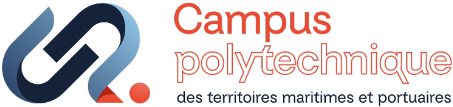
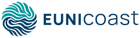

# @univ-lehavre/atlas-crf

Microservice HTTP CRF pour exposer une API REST au-dessus de REDCap.

## About

Ce service Hono encapsule le client REDCap Atlas et expose des routes, métadonnées projet, instruments, champs, records, PDF, liens de survey et recherche utilisateur par email. Il ajoute validation Effect, réponses d'erreur normalisées, rate limiting et documentation OpenAPI/Scalar côté serveur.

## Features

- **Health checks**: état du serveur REDCap, token et latence moyenne
- **Projet REDCap**: version, informations projet, instruments, champs et noms d'export
- **Records**: export, import, PDF et liens survey avec validation de requête
- **Utilisateurs**: résolution d'un utilisateur REDCap par email

## Usage

### Server

Depuis le monorepo:

```bash
# Required environment variables
export REDCAP_API_URL=https://redcap.example.com/api/
export REDCAP_API_TOKEN=AAAAAAAAAAAAAAAAAAAAAAAAAAAAAAAA
export PORT=3000

# Start the server
pnpm -F @univ-lehavre/atlas-crf start
```

Le package exporte aussi `createApp()` pour construire l'application Hono dans des tests ou dans un runtime serveur personnalisé.

## Server API

| Endpoint                                    | Description                   |
| ------------------------------------------- | ----------------------------- |
| `GET /health`                               | Health check                  |
| `GET /api/v1/project/version`               | REDCap version                |
| `GET /api/v1/project/info`                  | Project information           |
| `GET /api/v1/project/instruments`           | REDCap instruments            |
| `GET /api/v1/project/fields`                | REDCap data dictionary fields |
| `GET /api/v1/project/export-field-names`    | Export field name mappings    |
| `GET /api/v1/records`                       | Export records                |
| `POST /api/v1/records`                      | Import records                |
| `GET /api/v1/records/:recordId/pdf`         | Download record PDF           |
| `GET /api/v1/records/:recordId/survey-link` | Get survey link               |
| `GET /api/v1/users/by-email?email=...`      | Find a user                   |
| `GET /openapi.json`                         | OpenAPI specification         |
| `GET /docs`                                 | Scalar documentation          |

## Scripts

```bash
pnpm -F @univ-lehavre/atlas-crf start:dev        # Development server
pnpm -F @univ-lehavre/atlas-crf build            # Production build
pnpm -F @univ-lehavre/atlas-crf test             # Unit tests
pnpm -F @univ-lehavre/atlas-crf start            # Start built server
pnpm -F @univ-lehavre/atlas-crf test:api         # API tests
pnpm -F @univ-lehavre/atlas-crf test:integration # Integration tests
```

## Documentation

- [Documentation projet CRF](../../docs/projects/crf/index.md)
- Documentation interactive du service: `GET /docs`
- Spécification OpenAPI du service: `GET /openapi.json`

## Organization

This package is part of **Atlas**, a set of tools developed by **Le Havre Normandie University** to facilitate research and collaboration between researchers.

Atlas is developed as part of two projects led by Le Havre Normandie University:

- **[Campus Polytechnique des Territoires Maritimes et Portuaires](https://www.cptmp.fr/)**: research and training program focused on maritime and port issues
- **[EUNICoast](https://eunicoast.eu/)**: European university alliance bringing together institutions located in European coastal areas

---

<p align="center">
  <a href="https://www.univ-lehavre.fr/">
    
  </a>
  &nbsp;&nbsp;&nbsp;
  <a href="https://www.cptmp.fr/">
    
  </a>
  &nbsp;&nbsp;&nbsp;
  <a href="https://eunicoast.eu/">
    
  </a>
</p>

## License

MIT
